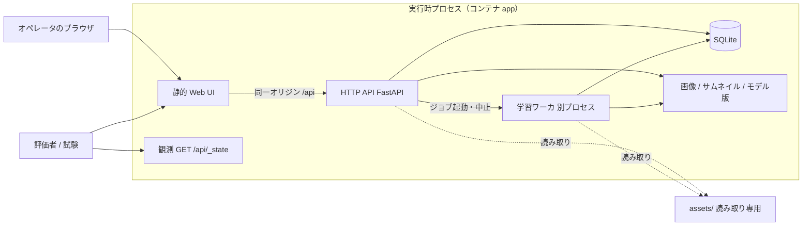
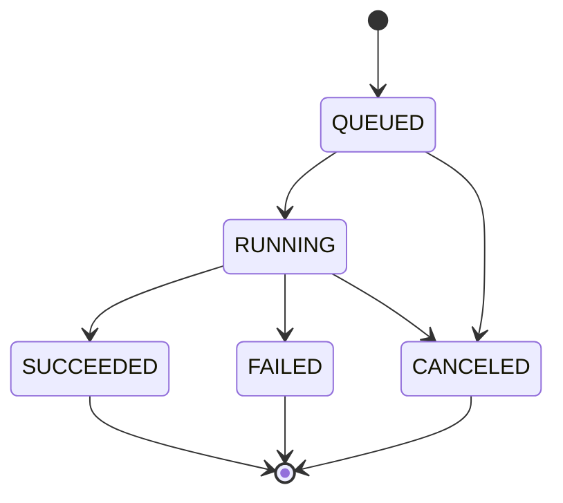

# FaunaLab 設計書（`DESIGN.md`）

| 項目 | 内容 |
| --- | --- |
| 対象 Issue | #3（機能 ID F002） |
| 正本 | SRS-FAUNALAB-002 **版 2.2**、TASK-FAUNALAB-001 版 1.0 |
| 状態 | 実装前の枠と初期判断。実装と食い違ったら実装に合わせて更新する。最終一致確認は F019 |
| 関連 | 言語・実行形態・データ配置の実装前合意は [docs/ARCHITECTURE.md](docs/ARCHITECTURE.md)（F001 / #2）。本ファイルは提出物の設計書であり、転記したうえで API・誤り・観測変換をここで固定する |

仕様に書かれていない事項ほど厚く書く。未決は「未決」と理由を残す。解釈は 10 節に集約する。

---

## 1. 全体構成

単一ホスト上の自己完結システムである。権威ある状態はサーバだけが持ち、Web UI は表示と操作に徹する（REQ-SYS-001）。実行時プロセスはコンテナ `app` 1 つとし、学習は同一コンテナ内の別プロセスにする。根拠と不採用案は ARCHITECTURE.md 2 節にあり、本節は提出物向けに責任分担だけを固定する。

### 1.1 要素と責任



| 要素 | 責任 | やり取り |
| --- | --- | --- |
| Web UI | 1.3.2 項の全機能。URL で画面復元。権威状態を持たない | 静的ファイルを取得し、操作は同一オリジンの HTTP API へ送る |
| HTTP API | プログラムインタフェース（3.1.2）。画像・ラベル・分割・学習・モデル・推論・候補 | JSON / マルチパート。OpenAPI 3.1 は実装と一致させる |
| 観測インタフェース | `GET /api/_state` のみ形式固定。読み取り専用。内部表現を SRS 語彙へ変換する | 評価と受入試験の状態確認 |
| 学習ワーカ | 同時実行 1 件の学習。進捗・ログ・成果物。API をブロックしない | API はキューへ登録してすぐ返す。ワーカは SQLite とファイルを更新する |
| SQLite | 画像メタデータ、ラベル、分割、ジョブ、モデル版、推論履歴 | 単一ファイル。データディレクトリ直下 |
| ファイルストア | 画像本体、サムネイル、モデル成果物、ジョブログ | `FAUNALAB_DATA_DIR` 配下のみへ書き込む |
| 配布資産 | ベースライン ONNX、クラスマップ、サンプル、フィクスチャ | 読み取り専用マウント。実行時書き込み禁止 |

学習を別コンテナにしない理由は、SQLite 共有とデータディレクトリ複製（REQ-ATT-POR-001）を単純に保つためである。

### 1.2 同期の境界

- アップロード・アノテーション・分割・有効化・推論・候補生成は API プロセス内の同期操作とする。
- 学習だけが非同期ジョブである。開始は直ちに戻り、進捗は SQLite 経由で `_state` と UI から観測する。
- 推論（最大 20 枚）と候補生成（最大 100 枚）が性能要求を割った場合の非同期化は、測定後に本ファイルへ反映する（現時点は同期のまま）。

### 1.3 モジュール分割

ARCHITECTURE.md 7 節の契約に従う。依存方向は `api` → `domain` → `persist` / `ml`。`ml` は FastAPI を import しない。観測エンドポイントは永続スキーマをそのまま返さない。

```
backend/faunalab/
  settings.py     # 環境変数
  api/            # HTTP。観測とプログラムインタフェース
    state.py      # GET /api/_state の変換
  domain/         # 不変条件とユースケース。HTTP に依存しない
  persist/        # SQLite とファイル I/O
  ml/             # 前処理、ベースライン畳み込み、学習、評価、ONNX 書き出し
  jobs/           # キュー、ワーカプロセス、中止
web/              # Vite + React + TypeScript
```

画面 URL とコンポーネント構成は **未決**（UI 骨格 Issue）。データディレクトリ配置は ARCHITECTURE.md 6.2 を正とする。

---

## 2. 技術選定

本節は F001 の決定を提出物の語彙へ転記する。変更が必要なら先に ARCHITECTURE.md を更新する。

### 2.1 採用

| 層 | 採用 | 理由 |
| --- | --- | --- |
| バックエンド | Python 3.12、FastAPI、Uvicorn | ML と API を同一言語に閉じ、OpenAPI 生成を REQ-API-002 に直結させる |
| データの保持 | SQLite（WAL、`foreign_keys=ON`）+ データディレクトリ上のファイル | プロセス追加なし。停止後にディレクトリ全体を複製すれば復元できる |
| 推論 | ONNX Runtime。学習成果は可能な限り ONNX へ書き出し、API プロセスは PyTorch を載せない | 配布資産が ONNX。常駐メモリ 1 GiB（REQ-PERF-006） |
| 学習 | PyTorch CPU。ベースライン利用時は凍結 embedding + 分類ヘッド。GPU は任意 | フルバックボーンは 4 論理 CPU・30 分制約に対して過剰 |
| 前処理 | torchvision（短辺 256・中央 224・ImageNet 正規化） | 出典と同じ実装で期待値差 0.02 以内を狙う |
| フロントエンド | TypeScript + Vite + React。静的成果物を API と同じオリジンで配信 | 既存の pnpm / Biome と整合。実行時 Node を増やさない |
| パッケージ管理 | バックエンドは uv（`pyproject.toml` / `uv.lock`）、フロントは pnpm | lefthook の osv-scanner 対象と一致 |
| 静的解析 | フロントは Biome、バックエンドは Ruff（型は Pyright または mypy） | REQ-ATT-MNT-003。型チェッカの選定は骨格 Issue（**未決**：Pyright か mypy か） |
| 試験 | pytest（API / `_state`）、Playwright（UI の一部） | SRS 4 章の「操作は UI、確認は `_state`」に合わせる |
| 実行環境 | **Podman**（ローカルおよび提出）。単一コマンドは Compose | リポジトリ共通制約。Cloud Agent では同一 OCI を Docker Compose で起動する |
| 学習の計算 | CPU で完結。GPU があれば使ってよいが必須ではない | REQ-HW-002、1.3.4 |

分類ヘッドの層数（線形のみか 1 隠れ層か）は **未決**。既定経路は線形とし、偶然水準を上回らなければ 1 隠れ層を DESIGN に追記する。

### 2.2 実行形態

| 環境 | セットアップ（ネットワーク可） | 実行（ネットワーク禁止） |
| --- | --- | --- |
| ローカル / 提出 | `podman compose build` | `podman compose up --pull never` |
| Cursor Cloud Agent | `docker compose build` | `docker compose up --pull never` |

差分はオーケストレータのバイナリ名だけとする。`--build` を実行コマンドに含めない。詳細（ポート、マウント、環境変数名）は ARCHITECTURE.md 5–6 節。

### 2.3 ライセンス確認（REQ-CON-003）

1. 依存追加の Issue / PR にパッケージ名、版、SPDX 識別子を書く。
2. SPDX が OSI 承認（MIT、Apache-2.0、BSD-2/3-Clause、ISC、PSF-2.0、MPL-2.0、Unlicense、BlueOak-1.0.0、HPND 等）であることを確認する。
3. メタデータが空または Custom なら LICENSE 本文を読む。対応が取れなければ採用しない。
4. GPL / AGPL / SSPL は OSI 承認でも **依存として採用しない**（許諾的な側へ寄せる解釈。緩める場合は人間が Issue で決める）。
5. セットアップ段階でライセンス一覧を生成してリポジトリに残す。実行段階ではライセンス取得のためにネットへ出ない。
6. ベースライン重みは `MANIFEST.json` の BSD-3-Clause を正とする。`assets/` は改変しない。

### 2.4 不採用（転記）

Django、PostgreSQL、TensorFlow、既定経路でのバックボーンファインチューン、Next.js / 実行時 Node、Kubernetes。理由は ARCHITECTURE.md 3.3。

---

## 3. API 設計

観測エンドポイント以外のパスは仕様が沈黙している。リソースの切り方と命名をここで固定する。JSON の全フィールド名と OpenAPI 本文は実装時に `openapi.yaml` へ落とし、F019 で一致確認する。未記載の細部は **未決** とし、本節の方針から外さない。

### 3.1 方針

- リソースは名詞の複数形。パスは `/api/{resources}`。観測だけ仕様どおり `/api/_state`。
- HTTP メソッドは RFC 9110 の意味に合わせる。生成は `POST`、置換は `PUT`、削除は `DELETE`、部分更新が必要な場合だけ `PATCH`。
- JSON フィールドは snake_case。観測インタフェース（`class_id`、`display_order`、`model_ref`）と揃える。
- 識別子は観測の `ref` と同一文字列をプログラムインタフェースでも使う。形式は 8 節。
- 日時は ISO 8601-1 の UTC、末尾 `Z`。
- 一覧は `limit`（件数制限）と `offset`（位置）を受け付け、`items` と `total` を返す（REQ-API-006）。既定 `limit=50`、上限 `200`。同一条件の順序は一意（8 節のソートキー）。
- Web UI は同一オリジンで API を呼ぶ。`FAUNALAB_CORS_ORIGINS` が空なら CORS は同一オリジンのみ（既定の提出形態）。
- 破壊的操作の確認ダイアログは UI の責務（REQ-USE-002）。API は確認トークンを要求しない。

### 3.2 リソースとパス

| リソース | パス | 操作 |
| --- | --- | --- |
| 観測 | `GET /api/_state` | 読み取り専用。形式は SRS 3.1.3 |
| 画像 | `POST /api/images` | マルチパート。1 回最大 50 ファイル。部分成功は 200 で件別結果 |
|  | `GET /api/images` | 絞り込み: `split`、`class_id`、`labeled`（論理積） |
|  | `GET /api/images/{ref}` | 詳細 |
|  | `DELETE /api/images/{ref}` | 画像・ラベル・候補・推論履歴・ファイルを削除。学習済モデル版は残す |
|  | `GET /api/images/{ref}/thumbnail` | 長辺 256 以下のサムネイル |
| 確定ラベル | `PUT /api/images/{ref}/label` | 付与または上書き。`source` は人手経路では `human` |
|  | `DELETE /api/images/{ref}/label` | ラベル解除（1.3.2）。候補は作らない |
|  | `POST /api/labels/bulk` | 同一クラスの一括付与。1 件でも不在なら全体失敗（REQ-F-ANN-004） |
| 分割 | `POST /api/splits` | 比率とシード。層化。未ラベルは `unassigned` のまま |
| 概況 | `GET /api/stats` | 総数、確定/未ラベル/候補、クラス別、分割別、有効モデル、ジョブ有無 |
| 学習ジョブ | `POST /api/jobs` | 直ちに 201。省略パラメータは既定値 |
|  | `GET /api/jobs` | 一覧（新しい順） |
|  | `GET /api/jobs/{ref}` | 詳細 |
|  | `GET /api/jobs/{ref}/logs` | エポック時系列 |
|  | `POST /api/jobs/{ref}/cancel` | 中止。終端なら失敗 |
| モデル版 | `GET /api/models` | 版番号降順 |
|  | `GET /api/models/{ref}` | 指標を含む詳細 |
|  | `POST /api/models/{ref}/activate` | 有効化。他を無効化 |
|  | `DELETE /api/models/{ref}` | 有効モデルと版 0 は失敗 |
|  | `POST /api/models/{ref}/evaluate` | 現在の試験分割で再評価 |
| 推論 | `POST /api/inferences` | 新規ファイルおよび/または登録済 `ref`。最大 20 |
|  | `GET /api/inferences` | 時系列（新しい順） |
| 候補ラベル | `POST /api/suggestions` | 生成。確定ラベル付きは読み飛ばし、件数を返す |
|  | `GET /api/suggestions` | 信頼度範囲と昇順/降順 |
|  | `POST /api/suggestions/accept` | 指定画像の採用 |
|  | `POST /api/suggestions/accept-by-threshold` | 閾値一括採用 |
|  | `POST /api/suggestions/reject` | 却下。対象不在は失敗 |
| サンプル投入 | `POST /api/sample/import` | `assets/sample/manifest.json` を読み確定ラベル `human` で登録 |

`GET /api/stats` を独立させた理由は、UI の概況（REQ-UI-006）を `_state` 全量に依存させないため。評価は `_state` で足りる。

学習開始の応答は 201 とし、`Location` にジョブのパスを置く。本体にも `ref` と観測語彙の `status` を含める。

### 3.3 検討して採らなかった案

| 案 | 不採用の理由 |
| --- | --- |
| ラベルを画像から独立した `/api/annotations` だけにする | 1 画像 0 または 1 件なので、画像の下位リソースの方が不変条件と一致する。一括だけ集合操作として残す |
| ジョブ中止を `DELETE /api/jobs/{ref}` にする | 削除ではなく状態遷移。履歴は残す（REQ-DATA-010） |
| 有効化を `PUT /api/models/active` にする | 対象モデルがパスから消える。`{ref}/activate` の方が操作対象が明確 |
| 部分成功アップロードを 207 Multi-Status にする | クライアントと OpenAPI が重い。1 件でも成功すれば 200 とし、件別 `ok` / `code` で区別する |
| JSON:API / HAL | 評価観点は一貫性と命名であり、過剰 |

### 3.4 未決（API）

- 各操作の応答 JSON の全フィールド（OpenAPI へ実装と同時に書く）。
- サムネイルの媒体型（JPEG に揃える想定だが、実装時に固定）。
- `POST /api/images` のフィールド名（`files` 想定）。
- ページングを cursor にする必要が出た場合。想定規模 5,000 では offset で足りる。

---

## 4. 誤りの表現

### 4.1 分類

誤りは次の 7 類に分け、**それぞれ異なる HTTP ステータスコード**にする（REQ-API-003）。同一ステータスに 2 類を載せない。

| 状況（SRS） | ステータス | 識別子の型（`code`） | 典型 |
| --- | --- | --- | --- |
| 要求内容の誤り | 400 Bad Request | `validation_error` | JSON 欠落、型不一致、比率の合計不正、件数上限（ファイル 50 / 推論 20 / 候補 100）を超える指定 |
| 対象の不在 | 404 Not Found | `{resource}_not_found` | 存在しない `ref`。却下対象の候補が無い |
| 現在の状態では実行できない操作 | 409 Conflict | 状況別（下記） | 終端ジョブの中止、有効モデル削除、版 0 削除、SHA-256 重複 |
| 前提条件の不成立 | 422 Unprocessable Content | 状況別（下記） | 学習開始条件不足、有効モデル無しの推論/候補、試験分割空の再評価、ベースライン利用なのに資産無し |
| 許可されない媒体型 | 415 Unsupported Media Type | `unsupported_media_type` | 拡張子ではなく内容判定で JPEG/PNG 以外 |
| 上限を超える大きさ | 413 Content Too Large | `payload_too_large` | 1 ファイル 10 MiB 超。本体を全量メモリへ載せる前に判定（REQ-ATT-SEC-005） |
| システム内部の予期しない誤り | 500 Internal Server Error | `internal_error` | 想定外例外。プロセスは落とさない |

409 と 422 の切り分け（解釈 I-ERR-001）:

- **409**: 対象リソースは存在するが、その状態が操作と衝突する。
- **422**: 対象が無いわけでも状態遷移として禁じられているわけでもなく、システム全体の前提（枚数、有効モデル、資産）が足りない。

412 Precondition Failed は使わない。RFC 9110 の 412 は条件付き要求（If-*）向けであり、本システムの前提条件とは意味がずれる。

### 4.2 応答形式

誤り応答は RFC 9457 の Problem Details とする。`Content-Type` は `application/problem+json`。

```json
{
  "type": "urn:faunalab:error:image_not_found",
  "title": "Not Found",
  "status": 404,
  "detail": "指定した画像は存在しません。",
  "code": "image_not_found"
}
```

- `code` が機械判別用の識別子（REQ-API-004）。OpenAPI の誤り語彙に全件を列挙する。
- `detail` は利用者へ出してよい説明。日本語。内部パス・SQL・スタックトレースを含めない（REQ-API-005）。
- `type` は `urn:faunalab:error:{code}`。実行時ネットへ解決しに行かない。
- 追加フィールド（例: アップロード件別の `items`）は成功応答側に置く。誤り 1 件の本体を配列にはしない。

複数アップロードは操作全体を誤りにしない（REQ-F-IMG-005）。HTTP は 200、各要素に `ok` と失敗時 `code` を付ける。件別失敗の `code` も上表と同じ語彙にする。

### 4.3 識別子の語彙（初期）

| `code` | ステータス | 意味 |
| --- | --- | --- |
| `validation_error` | 400 | 要求の構文・型・列挙値・相関（例: 分割比率）が不正 |
| `unsupported_media_type` | 415 | 許可されない媒体型 |
| `payload_too_large` | 413 | サイズ上限超過 |
| `image_not_found` | 404 | 画像不在 |
| `job_not_found` | 404 | ジョブ不在 |
| `model_not_found` | 404 | モデル版不在 |
| `inference_not_found` | 404 | 推論履歴不在（単体取得を足す場合） |
| `suggestion_not_found` | 404 | 却下対象の候補が無い |
| `image_duplicate` | 409 | 同一 SHA-256 が既登録 |
| `job_not_cancelable` | 409 | 終端状態への中止 |
| `model_not_deletable` | 409 | 有効モデルまたは版 0 の削除 |
| `training_precondition` | 422 | REQ-F-TRN-004 を満たさない |
| `no_active_model` | 422 | 有効モデルが無い推論・候補生成 |
| `empty_test_split` | 422 | 試験分割が空の再評価 |
| `baseline_unavailable` | 422 | ベースライン利用ありだが資産が使えない |
| `sample_unavailable` | 422 | `assets/sample/` が無い投入 |
| `internal_error` | 500 | 予期しない内部誤り |

語彙を増やす場合は接頭辞をリソース名にし、ステータス 7 類のいずれかに必ず対応付ける。新しいステータス番号を勝手に増やさない。

---

## 5. 状態の管理

### 5.1 学習ジョブの保持

ジョブ行を SQLite に持ち、パラメータ・進捗・失敗原因・時刻を永続化する（REQ-DATA-001）。エポックログは `jobs/{ref}/` 配下の追記ファイルと、取得用の表（または JSONL）に持つ。再起動後も履歴が残る。

内部状態名は観測語彙と同一にする（`QUEUED` / `RUNNING` / `SUCCEEDED` / `FAILED` / `CANCELED`）。変換バグを避けるため、別名を設けない（解釈 I-JOB-001）。

### 5.2 遷移

REQ-F-TRN-006 の経路のみ許す。終端からの遷移は無い。



開始 API は行を `QUEUED` で挿入して 201 を返す。ワーカが 1 件だけ `RUNNING` へ進め、成功時にモデル版を 1 件生成してから `SUCCEEDED` にする。中止されたジョブはモデル版を生成しない。

### 5.3 同時実行 1 件

- ワーカプロセスは常に 1 つ。`QUEUED` を作成順に 1 件ずつ `RUNNING` にする。
- SQLite の部分一意索引（`status = 'RUNNING'` の行を高々 1）で二重実行を防ぐ。競合したら当該開始をやり直し、同時 `RUNNING` を観測させない。
- API は実行中の有無にかかわらず新しいジョブを `QUEUED` で受け付ける（REQ-F-TRN-005）。拒否しない。

### 5.4 中止

`POST .../cancel` は協調キャンセルフラグを立てる。`QUEUED` は直ちに `CANCELED`。`RUNNING` はワーカが 10 秒以内に学習ループを抜けて `CANCELED` にする（REQ-F-TRN-008）。終端への中止は 409 `job_not_cancelable`。

強制 kill は使わない。10 秒を守れない実装になった場合は本節を更新する。

### 5.5 異常終了からの回復

API プロセス起動時（ワーカより先）に、`status = 'RUNNING'` の行を `FAILED` へ遷移させ、失敗原因を「プロセス中断」と記録する（REQ-F-TRN-014）。`QUEUED` は残し、ワーカが再開する。中途のモデル成果物ディレクトリは採用せず削除する。この手順のあと 3.5.3 の不変条件が成立していることを起動時に検算する（REQ-ATT-REL-002）。

学習中の例外はジョブを `FAILED` にし、サーバプロセスは落とさない（REQ-F-TRN-012、REQ-ATT-REL-001）。

---

## 6. 不変条件の保証

保証は「DB 制約で安価に表せるもの」と「ドメイン層で閉じるもの」に分ける。操作のたびに `_state` へ写せる形で検算可能にする。

| 要求 | 条件 | 保証 |
| --- | --- | --- |
| REQ-DATA-003 | 同一 SHA-256 の画像が 2 件以上無い | `images.sha256` 一意制約。衝突は 409 `image_duplicate` |
| REQ-DATA-004 | 確定ラベルは画像あたり高々 1 | `labels.image_id` 一意。付与は UPSERT（上書き） |
| REQ-DATA-005 | 候補ラベルは画像あたり高々 1 | `suggestions.image_id` 一意。再生成は上書き |
| REQ-DATA-006 | 確定と候補を同時に持たない | 同一トランザクションで、確定付与時に候補削除、候補生成は未ラベルのみ。UI/API の順序逆転もトランザクションで直列化 |
| REQ-DATA-007 | 有効モデルは高々 1 | 部分一意索引（`active = 1`）。有効化はトランザクション内で他を落とす |
| REQ-DATA-008 | 内蔵は版 0 のみ、版 0 は内蔵のみ | `version` 一意。`builtin` は `version = 0` と一致する CHECK |
| REQ-DATA-009 | 存在しない画像をラベル・候補・推論が参照しない | `FOREIGN KEY ... ON DELETE CASCADE`（推論は画像削除時に履歴も消す。REQ-F-IMG-009） |
| REQ-DATA-010 | ジョブ履歴はモデル削除後も残る | ジョブからモデルへの FK は `ON DELETE SET NULL`。ジョブ行は消さない |

起動時および学習ワーカ開始時に上記を SQL で検算し、違反があれば起動を続けつつ 500 相当をログに残すか、修復可能なもの（残存 `RUNNING`）だけ修復する。修復方針の追加は実装時。**未決**: 修復不能な破損 DB を拒否して起動するか、空で起きるか。想定は「警告して起動し、書き込み API は 500」だが、骨格実装まで確定しない。

---

## 7. ベースラインモデルの利用

### 7.1 読み込み

起動時に `FAUNALAB_ASSETS_DIR/baseline/MANIFEST.json` を読む。記載ファイルの SHA-256 を照合し、`class_map.json` のキー集合が 8 クラスと一致すること、ImageNet 索引の二重割当が無いことを確認する（REQ-F-BASE-005）。クラス対応はファイルからのみ読み、ソースに埋め込まない（REQ-F-BASE-009）。

成功時のみモデル版 0 を登録し、有効モデルが未設定なら版 0 を有効化する。失敗・不在時は版 0 を登録せず警告して起動を続ける（REQ-F-BASE-006、REQ-CON-007）。重みはデータディレクトリへ複製しない。

### 7.2 推論（版 0）

ONNX Runtime で `logits` を得る。softmax → クラスマップ合算 → その他質量 `1 − Σ s(c)` → `Σ s(c) ≥ 1e-6` なら `s(c)/Σ s(c)`、未満なら全クラス 0.125 かつ低信頼。未収録クラス（`american_bulldog`、`havanese`）の s(c) は常に 0。補間・温度スケーリング・事前確率補正はしない。

共通前処理は REQ-F-BASE-002 の 5 ステップ。学習・評価・推論で同一実装を使う。

### 7.3 学習

- **ベースライン利用あり（既定）**: 画像の embedding（1280 次元）を ONNX で固定抽出し、分類ヘッドだけを PyTorch で学習する。成功時ヘッドを ONNX に書き出し、推論は API プロセスの ONNX Runtime だけにする。
- **ベースライン利用なし**: 小型 CNN を CPU で学習し、成功時 ONNX へ書き出す。資産が無い起動でもこの経路は動く。
- データ拡張（左右反転・ランダム切り出し）は訓練分割のみ。検証・試験には共通前処理だけ。
- 学習済モデルの推論では `other_mass` を常に `null` にする（REQ-OBS-007）。

---

## 8. 観測インタフェースの実装

`GET /api/_state` は読み取り専用のアダプタである。内部表・ファイル・列名をそのまま返さない。追加キーは許容されるが、必須キーと列挙値は SRS 3.1.3 に閉じる。

### 8.1 `ref`

形式は UUID version 4（小文字、ハイフン付き 36 文字）。対象が存在する限り不変。削除後に再利用しない（REQ-OBS-003）。内部主キー（整数）とは別に公開 `ref` 列を持つ。整数 ID を `ref` にしない（再利用と推測を避ける）。

### 8.2 フィールド変換

| `_state` | 内部からの変換 |
| --- | --- |
| `schema_version` | 常に `1` |
| `observed_at` | 応答生成時刻（UTC、`Z`） |
| `classes` | 起動時に登録した 8 クラス。`display_order` 昇順。`class_id` は 3.5.2 項の識別子そのもの |
| `images[].sha256` | 登録時に計算した小文字 hex |
| `images[].split` | 内部列を `train` / `val` / `test` / `unassigned` へ。未割当と未ラベルは `unassigned` |
| `images[].label` | 確定ラベル無ければ `null`。あれば `{ class_id, source }`。`source` は `human` または `model_suggested` のみ |
| `images[].suggestion` | 候補無ければ `null`。あれば `{ class_id, confidence, model_ref }` |
| `jobs[].status` | 内部状態をそのまま出す（5.1） |
| `jobs[].current_epoch` | 未開始は `0`。実行中は完了済エポック数 |
| `jobs[].total_epochs` | ジョブパラメータ（既定 10） |
| `jobs[].model_ref` | 成功して版が付いたときだけ。それ以外は `null` |
| `jobs[].failed` | `status == "FAILED"` のときだけ `true`。冗長だが必須キーなので計算して入れる |
| `models[].version` | 整数。版 0 がベースライン |
| `models[].builtin` | 版 0 のみ `true` |
| `models[].active` | 有効なら `true`。高々 1 件 |
| `models[].metrics` | 未評価は `null`。評価済は 8.3 |
| `inferences[].other_mass` | 版 0 なら実数、学習済モデルなら `null` |
| `inferences[].low_confidence` | 閾値（環境変数）と 7.2 の全 0.125 規則 |
| `inferences[].top_class_id` / `top_confidence` | 8 クラス信頼度の最大。同率は `display_order` が小さい方（解釈 I-OBS-001） |

一覧の決定的順序（API と `_state` で共通の安定ソート）:

- `classes`: `display_order` 昇順
- `images`: `created_at` 昇順、同刻なら `ref` 昇順
- `jobs`: `created_at` 昇順、同刻なら `ref` 昇順
- `models`: `version` 昇順
- `inferences`: `created_at` 昇順、同刻なら `ref` 昇順

`_state` の配列順を仕様は固定していないが、試験の再現のため昇順に固定する。

### 8.3 指標（`metrics`）

`per_class` は 8 クラスすべてをキーに持つ（REQ-OBS-006a）。

- 予測件数 0 → precision = 0.0
- 正解件数 0 → recall = 0.0
- 両方 0 → F1 = 0.0
- それ以外の F1 は通常の調和平均

`confusion_matrix.labels` は `classes` の `display_order` 昇順。`matrix[i][j]` は正解 `labels[i]`、予測 `labels[j]`。`accuracy` は対角和 / 総和。四捨五入ではなく、附属書 5.3 照合は絶対誤差 0.0001（VER-DATA-004）。

実装は `assets/fixtures/metrics_fixture.json` と附属書 5.3 を単体試験の固定入力にする。SRS 版 2.2 の内訳（`american_bulldog` の予測は `boxer`、accuracy 0.7778）を正とする。

### 8.4 副作用

`GET /api/_state` は DB 書き込みもファイル書き込みもしない。連続 2 回の呼び出しは、その間に他操作が無ければ一致する（VER-OBS-001）。Web UI 経由の変更もプログラムインタフェース経由の変更も、同じ表を読むため区別なく反映する（REQ-OBS-009）。

想定規模で 5 秒以内（REQ-OBS-008）。画像 5,000 を毎回フルスキャンして足りなければ、**未決** としてキャッシュまたは集計表を足す。導入する場合も書き込みは他操作側だけにする。

---

## 9. 検証の方針

タスク書類は「すべての検証項目を実装する必要はない。範囲と理由を明記せよ」と定める。本節は実装前の選択である。カバレッジ表は試験コード側にも REQ/VER ID をコメントまたは一覧で残す。

### 9.1 自動試験（pytest、ネットワーク無し）

優先して自動試験にする（機械照合が可能で、観測契約・誤分類・ベースラインに直結するため）:

- VER-OBS-001（`_state` 構造・列挙・副作用無し）
- VER-API-001 のうち OpenAPI と 7 類ステータスの区別、本文にパス/トレースが無いこと
- VER-F-IMG-001〜005、VER-F-ANN-001、VER-F-DS-001〜002
- VER-F-TRN-001〜007（プロセス強制終了はコンテナ内で pytest から子プロセスを落とす）
- VER-F-MDL-001〜002、VER-F-INF-001〜002
- VER-F-BASE-001〜004、VER-F-SUG-001〜004、VER-F-SYS-001
- VER-DATA-001〜004
- VER-ATT-001 の API 部分、VER-CON-002 のライセンス一覧と環境変数

試験の単一コマンドは骨格 Issue で固定する（`uv run pytest` または compose）。Playwright ブラウザ取得はセットアップ段階。

### 9.2 UI 自動操作（Playwright）

SRS 4.0 は「状態変更は Web UI 自動操作、確認は `_state`」と書く。次を UI 経由でも 1 本以上通す: サンプル投入 → 候補生成/採用 → 学習開始の観測 → 推論。VER-UI-001 の全画面・全 URL は段階的に足す。

### 9.3 手動または提出時の実証

| 項目 | 理由 |
| --- | --- |
| VER-USE-001（15 分被験者） | 被験者試験はリポジトリの自動試験に載せない。手順と画面案内は README / UI 空状態文で担保し、人間レビューに委ねる |
| VER-USE-003（コントラスト・キーボード） | 推奨（S）。自動計測は任意。AA は目指すが初期自動試験の必須から外す |
| VER-PERF-001〜003 | 基準環境（4 論理 CPU、8 GB）での測定が必要。Cloud Agent では参考値のみ。提出前に測定結果を本節へ追記する |
| VER-CON-001（ネット遮断起動） | compose の `--pull never` と実行時クライアント不在で設計適合。実遮断は提出環境で実証 |
| VER-ATT-004（ディレクトリ複製） | 停止後のディレクトリ全体コピーという契約（ARCHITECTURE.md 6.4）を手順試験にする。CI では縮小データで可 |

### 9.4 初期に自動試験しないもの

- VER-USE-002 の全画面目視。空状態文言はコンポーネント試験または Playwright の部分で拾う。
- GPU 経路。GPU は任意であり、CPU 経路だけを自動試験する。

行カバレッジ 70 %（REQ-ATT-MNT-001）は pytest-cov で計測する。届かないモジュールは F019 までに埋める。

---

## 10. 未解決事項と既知の制約

### 10.1 解釈ログ（質問できない曖昧さは解釈して進める）

仕様に曖昧点や矛盾があっても質問はできない（TASK-FAUNALAB-001「進め方」）。解釈して進め、妥当性も評価対象である。以下を本提出の解釈とする。

**I-SRC-001 正本 SRS は版 2.2**
タスク書類の参照仕様は「SRS-FAUNALAB-002 版 2.0」である。リポジトリの正本 `docs/source-of-truth/srs-faunalab.md` は **版 2.2**（承認済・基線化済）である。版 2.0 以降の差分のうち設計記述の削除は 2.0、観測と附属書の差し替えは 2.1、附属書 5.3 の誤分類 1 件（`american_bulldog` を `samoyed` としていた非現実な組）を `boxer` へ移したのが 2.2 である。accuracy 0.7778 は変わらない。**リポジトリの版 2.2 を優先する。** タスク書類の「2.0」は古い参照と解釈し、版 2.2 の本文・附属書・`metrics_fixture.json` に合わせる。

**I-ENV-001 実行環境は Podman**
SRS もタスク書類もコンテナエンジンを指定しない。リポジトリ共通制約および F001 により、ローカルと提出時の起動は **Podman** とする。Cursor Cloud Agent 上では同一の OCI イメージを Docker で動かしてよい。Compose ファイルとイメージ内容は分岐させない。

**I-PROC-001 質問できない曖昧さは解釈して進める**
曖昧さは本節に記録し、後続 Issue はここに無い限り本解釈に従う。覆す場合は本節を更新してから実装する。

**I-ERR-001 409 と 422**
REQ-API-003 の「現在の状態では実行できない操作」と「前提条件の不成立」はどちらも状態依存に読める。前者を対象リソースの状態衝突（409）、後者をシステム前提の不足（422）と置く。412 は使わない（4.1）。

**I-ERR-002 媒体型とサイズ**
VER-F-IMG-001 は偽装テキストと 10 MiB 超 JPEG でステータスが異なることを求める。内容が JPEG/PNG でなければ 415、サイズ超過は 413 とする。拡張子は見ない。

**I-JOB-001 内部状態名**
観測語彙と内部状態名を一致させる。仕様は一致を要求しないが、禁止もしない。

**I-OBS-001 信頼度同率の最上位**
最上位クラスの tie-break は仕様が沈黙する。`display_order` が小さいクラスを `top_class_id` とする（混同ペアが隣接する並びを優先）。

**I-OBS-002 `failed`**
`jobs[].failed` は `status == "FAILED"` の導出値とする。`CANCELED` は `failed: false`。

**I-API-001 部分成功の HTTP**
複数アップロードの部分成功は 200 + 件別結果とする。207 にしない（3.3）。

**I-API-002 ラベル解除**
1.3.2 は「ラベル解除」を機能に含めるが、3.2.2 は付与・上書き・一括に厚い。解除は `DELETE /api/images/{ref}/label` で確定ラベルを外し、分割は `unassigned` に戻す（確定が無い画像は分割対象外、REQ-F-DS-004）。

**I-USE-001 犬種知識を前提にしない**
人手の 1 枚ラベルを必須手順にしない。主経路はサンプル投入 → 候補生成と採用 → 学習 → 推論とする（REQ-USE-001）。

**I-CON-001 copyleft 依存**
REQ-CON-003 より狭く、GPL/AGPL/SSPL を依存から外す（2.3）。仕様必須より厳しい自己制約である。

**I-POR-001 複製は停止後**
REQ-ATT-POR-001 は複製手順を書かない。WAL のため、稼働中コピーは同一時点を保証できない。契約はサービス停止後のディレクトリ全体コピーに限る。

### 10.2 仕様を満たせなかった箇所

現時点の実装は無い。本 Issue の範囲外。実装後に未達があれば本項へ移す。

### 10.3 判断を保留した箇所（未決）

| 項目 | 理由 |
| --- | --- |
| OpenAPI 全文、JSON フィールドの最終集合 | 実装と一致させるのが REQ-API-002。枠だけ先に決め、本文は実装 Issue |
| SQLite 表定義の列詳細、マイグレーション手段 | 不変条件と `ref` 方針は固定済。DDL は永続化 Issue |
| UI の画面 URL とコンポーネント分割 | REQ-UI-002 を満たせばよく、骨格 Issue で決める |
| 型チェッカ（Pyright / mypy）、分類ヘッド層数 | 骨格と学習の測定が必要 |
| `_state` の 5 秒を超える場合のキャッシュ | 実測前に入れない |
| 破損 DB の起動継続 vs 拒否 | 6 節。修復不能ケースの運用が未整備 |
| 推論・候補の非同期化 | 同期で性能を満たせると仮定。満たせなければ更新する |
| `.cursor/environment.json` の Python 依存 | lockfile 追加時（F001 が骨格へ委譲） |

### 10.4 時間があれば改善したい箇所

- 学習ログの構造化（OpenTelemetry は実行時ネット禁止のためローカルのみ）。
- サムネイル生成の遅延評価。
- Playwright による VER-UI-001 の網羅。
- ライセンス一覧の生成を CI に載せる。

### 10.5 既知の制約

- 同時学習は 1 件。認証は無い。信頼されたネットワーク向け。
- 実行段階の外部ネットワークは禁止（REQ-CON-001、REQ-COM-002）。
- `docs/source-of-truth/` と `assets/` は読み取り専用。生成・改変・削除・リネーム・移動をしない。
- ベースラインは未収録 2 クラスを予測しない。これは欠陥ではなく 3.5.2 の意図である。
- Windows 対応は任意。提出と開発の正は Linux / macOS + Podman（Cloud は Docker）。
)
