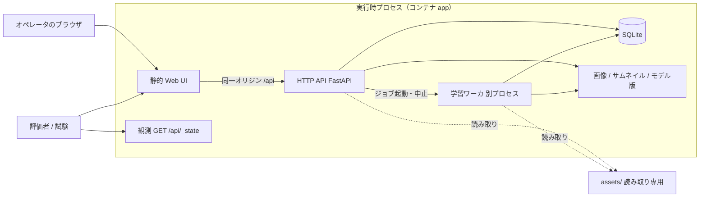

# FaunaLab アーキテクチャ（実装前合意）

| 項目 | 内容 |
| --- | --- |
| 対象 Issue | #2（機能 ID F001） |
| 正本 | SRS-FAUNALAB-002 版 2.2、TASK-FAUNALAB-001 |
| 状態 | 実装前の合意。後続 Issue はこの文書に従う |
| 非対象 | 提出物の `DESIGN.md`。最終設計書は実装と一致させたあとで書く |

本書は、仕様が沈黙している事項（言語、フレームワーク、データの保持、モジュール分割、実行形態）を固定する。観測インタフェース `GET /api/_state` と配布資産 `assets/` 以外の API パス・誤り語彙・内部状態名は、後続 Issue で詳細化する。

---

## 1. 決定事項一覧

後続 Issue が迷わず選べるよう、採否を先に示す。根拠は以降の節。

| 事項 | 決定 |
| --- | --- |
| バックエンド | Python 3.12、FastAPI、Uvicorn |
| データの保持 | SQLite（WAL）+ データディレクトリ上のファイル |
| 推論 | ONNX Runtime。学習成果は可能な限り ONNX へ書き出し、API プロセスは PyTorch を載えない |
| 学習 | PyTorch CPU。ベースライン利用時は凍結 embedding + 分類ヘッド。GPU は任意 |
| フロントエンド | TypeScript + Vite + React。静的成果物を API と同じオリジンで配信 |
| パッケージ管理 | バックエンドは uv（`pyproject.toml` / `uv.lock`）、フロントは既存の pnpm |
| 静的解析 | フロントは Biome、バックエンドは Ruff（型は Pyright または mypy。骨格 Issue で設定） |
| 試験 | pytest（API / `_state`）、Playwright（UI の一部） |
| 実行環境 | **Podman**（ローカルおよび提出）。単一コマンドは Compose |
| Cloud Agent | 同一 OCI イメージを **Docker Compose** で起動する。Podman は使わない |
| 学習の計算 | CPU で完結させる。GPU があれば使ってよいが必須ではない |

---

## 2. 全体構成

システムは単一ホスト上の自己完結システムである。権威ある状態はサーバ側だけが持ち、Web UI は表示と操作に徹する（REQ-SYS-001）。

### 2.1 要素と責任



| 要素 | 責任 | やり取り |
| --- | --- | --- |
| Web UI | 1.3.2 項の全機能を画面から操作する。URL で画面が復元できる。権威ある状態を持たない | ブラウザは静的ファイルを取得し、操作は HTTP API へ送る |
| HTTP API | プログラムインタフェース（3.1.2）。画像・ラベル・分割・学習・モデル・推論・候補ラベル | JSON / マルチパート。OpenAPI 3.1 は実装と一致させる（後続でパスを決める） |
| 観測インタフェース | `GET /api/_state` のみ形式固定。読み取り専用。内部表現を SRS の語彙へ変換する | 評価と受入試験が状態確認に使う |
| 学習ワーカ | 同時実行 1 件の学習。進捗・ログ・成果物。API をブロックしない | API はキューへ登録してすぐ返す。ワーカは SQLite とファイルを更新する |
| SQLite | 画像メタデータ、ラベル、分割、ジョブ、モデル版、推論履歴 | 単一ファイル。データディレクトリ直下 |
| ファイルストア | 画像本体、サムネイル、モデル成果物、ジョブログ | データディレクトリ配下のみへ書き込む |
| 配布資産 | ベースライン ONNX、クラスマップ、サンプル、フィクスチャ | マウントは読み取り専用。実行時書き込み禁止 |

コンテナは **サービス 1 つ（`app`）** とする。学習を別コンテナにしない。理由は、SQLite を複数コンテナで共有するとロックと移植（ディレクトリ複製）が複雑になるため。学習は同一コンテナ内の **別プロセス** とし、API プロセスの応答を阻害しない（REQ-ATT-AVL-001、REQ-PERF-005）。

起動時、API プロセスは残存する実行中ジョブを失敗へ遷移させる（REQ-F-TRN-014）。

### 2.2 同期の境界

- アップロード・アノテーション・分割・有効化など短い操作は API プロセス内で完結する。
- 学習だけが非同期ジョブ。開始は直ちに戻り、進捗は SQLite 経由で `_state` と UI から観測する。
- 推論と候補ラベル生成は同期 API とする（1 回最大 20 / 100 枚）。長時間化する場合の非同期化は、測定で必要になったときに DESIGN.md へ反映する。

---

## 3. 技術選定

### 3.1 採用と理由

| 層 | 採用 | 理由 |
| --- | --- | --- |
| Python 3.12 | バックエンドと ML を同一言語に閉じる。3.12 は PyTorch / ONNX Runtime の車輪が安定している | 推論と学習を別言語にすると、前処理一致（REQ-F-TRN-016、REQ-F-BASE-002）の保証が難しくなる |
| FastAPI + Uvicorn | ASGI、型付きの要求/応答、OpenAPI 生成が REQ-API-002 に直結する | Flask は OpenAPI を別途組み立てるコストが大きい |
| SQLite | プロセス追加なし。**サービス停止後に**データディレクトリ全体を複製すれば復元できる（REQ-ATT-POR-001、手順は 6.4）。想定規模は画像 5,000・モデル 50 | PostgreSQL はセットアップと実行の分離、単一コマンド起動を重くする |
| ONNX Runtime | 配布資産が ONNX（opset 13、入力 `[N,3,224,224]`、出力 `logits` と `embedding`） | 形式変換せずにベースラインを読める |
| PyTorch CPU | 学習の実装。ベースライン利用時は embedding（1280 次元）を入力とする分類ヘッドのみを訓練する | フルバックボーン学習は 4 論理 CPU・30 分制約（REQ-PERF-004）に対して過剰 |
| torchvision | 共通前処理（短辺 256・中央 224・ImageNet 正規化）をベースライン出典と同じ実装で行う | 期待値差 0.02 以内（REQ-F-BASE-010）をコードの独自リサイズに頼らない |
| TypeScript + Vite | 既存の pnpm / Biome と整合。SPA として API に状態を集約する | Next.js の SSR は権威状態をサーバに置く方針と利益が薄く、実行時 Node が増える |
| React | 画面群（画像、アノテーション、学習、モデル、推論）と URL 復元（REQ-UI-002） | ルーティングとコンポーネント分割が後続 Issue で衝突しにくい |
| uv | `uv.lock` を lefthook の osv-scanner 対象が既に想定している。セットアップ段階で依存を閉じる | pip 素の requirements より再現性が高い |
| pytest | API と `_state` 契約、指標計算、前処理、ジョブ遷移 | 実行時ネットワークに依存しない（REQ-ATT-MNT-002） |
| Playwright | SRS 4 章が「状態変更は Web UI 自動操作、確認は `_state`」と定めている | 全画面ではなく、受入に効く経路から足す |

SQLite の接続は WAL と `foreign_keys=ON` を既定にする。不変条件のうち DB で安価に表せるもの（SHA-256 一意、ラベル 1 対 1、有効モデル高々 1）は制約または一意索引で保証し、残りはドメイン層で保証する。詳細なスキーマは骨格 / 永続化の Issue に委ねる。

### 3.2 学習と推論の役割分担

- **ベースライン推論（モデル版 0）**: ONNX の `logits` に softmax し、`class_map.json` で 8 クラスへ畳み込む。その他質量と再正規化は SRS の規則のみ。補間や温度スケーリングは行わない。
- **ベースライン利用の学習（既定）**: 訓練・検証画像の embedding を ONNX で求め、分類ヘッド（線形、必要なら 1 隠れ層）を PyTorch で学習する。成功時にヘッドを ONNX へ書き出し、モデル版の成果物とする。推論時 `other_mass` は `null`。
- **ベースラインなし学習**: 配布資産が無い起動（REQ-CON-007）でも成立するよう、小型 CNN を PyTorch で CPU 学習し、成功時に ONNX へ書き出す。
- **常駐メモリ**: API プロセスは ONNX Runtime と SQLite をロードする。PyTorch は学習ワーカプロセスでのみ import する（REQ-PERF-006 の常駐 1 GiB）。

GPU は PyTorch / ONNX Runtime が検出すれば使ってよい。無い場合は CPU。実行可能性も性能要求も GPU に依存させない（REQ-HW-002、1.3.4）。

### 3.3 不採用

| 案 | 不採用の理由 |
| --- | --- |
| Django / Django Ninja | 管理画面と ORM の利益より、OpenAPI と非同期ジョブを小さく持つ方が SRS に合う |
| PostgreSQL / 別 DB サーバ | 単一コマンドとデータディレクトリ複製の移植要件に対して過剰 |
| TensorFlow | ベースラインが ONNX。学習側を PyTorch に揃える |
| バックボーンごとファインチューン（既定経路） | CPU 30 分制約と、配布 embedding の意図（1280 次元が MANIFEST にある）に対して過剰。必要なら DESIGN.md で例外を書く |
| Next.js / 実行時 Node | 提出時のプロセスを Python 1 系統に閉じる |
| Kubernetes / 複数レプリカ | 単一ホスト・認証なし・同時学習 1 件 |

---

## 4. ライセンス確認方針（REQ-CON-003）

REQ-CON-003 は、依存ライブラリを OSI 承認のオープンソースライセンス、またはそれと同等以上に許諾的なものに限る。

### 4.1 判定手順

1. 依存を追加する Issue / PR で、パッケージ名、版、SPDX 識別子を書く。
2. SPDX が OSI 承認（MIT、Apache-2.0、BSD-2-Clause、BSD-3-Clause、ISC、PSF-2.0、MPL-2.0、Unlicense、BlueOak-1.0.0、HPND 等）であることを確認する。
3. メタデータが空または「Custom」の場合は、配布されている LICENSE 本文を読み、OSI 承認との対応が取れなければ採用しない。
4. セットアップ段階（ネットワーク可）でライセンス一覧を生成してリポジトリに残す手段を、骨格 Issue で入れる。実行段階ではライセンス取得のためにネットへ出ない。
5. ベースライン重みとサンプル画像のライセンスは配布資産の記載を正とする（`MANIFEST.json` のモデルは BSD-3-Clause）。`assets/` は改変しない。

### 4.2 プロジェクトとしての追加方針

GPL / AGPL / SSPL 等は OSI 承認でも、成果物全体を copyleft にする、または SaaS 条項で提出物の扱いが不明になる。**依存としては採用しない。** これは「同等以上に許諾的」側へ寄せる解釈であり、仕様の必須より狭い。緩める場合は Issue で人間が決める。

検証 VER-CON-002 の「依存関係の一覧からライセンスを検査する」に対し、提出時はロックファイルと生成した一覧を検査対象とする。

---

## 5. 実行形態（Podman / Cloud / セットアップと実行）

実行環境は **Podman** である（ローカルおよび提出時の起動）。単一起動は Compose とする（REQ-CON-002、REQ-ATT-POR-002）。

### 5.1 セットアップ段階と実行段階

| 段階 | ネットワーク | やること | コマンド（契約） |
| --- | --- | --- | --- |
| セットアップ | 利用してよい | OCI イメージのビルド。Python / Node 依存の取得。Playwright ブラウザ等、実行に必要な非ソース成果をイメージへ焼き込む | リポジトリ直下で `podman compose build` |
| 実行 | 禁止（REQ-CON-001、REQ-COM-002） | 既にビルド済みのイメージを起動する。起動時も学習時も外部から資産を取得しない | リポジトリ直下で `podman compose up --pull never` |

実行段階の単一コマンドは `podman compose up --pull never` とする。初回にビルドが必要な場合は、セットアップを先に行う。`--build` を実行コマンドに含めない（セットアップと実行を混ぜない）。

イメージ内にベースライン重みは **コピーしない**。`assets/` はホスト（または提出ディレクトリ）から読み取り専用マウントする。無い状態でも起動する（REQ-CON-007）。

待受は HTTP/1.1。Compose ではコンテナ内プロセスは常に 8000 で待ち受け、ホスト公開だけを `FAUNALAB_PORT`（既定 8000）で変える（REQ-COM-001）。公開と待受の対応は 5.2 と 6.1 を正とする。

アプリケーションコードは、ループバックと同一ホスト内通信を除き、外部ネットワークへ接続しない。Compose のポート公開は inbound のみを意図する。実行時に依存やモデルを取得するクライアントを置かない。

### 5.2 Compose の契約

リポジトリ直下の `compose.yaml`（F004）は、次を満たす。アプリ本体は後続の骨格 Issue で置き換える。イメージとマウントの契約は本節が正である。

- サービス名は `app` のみ。
- ビルド文脈はリポジトリルート。イメージ名は `faunalab:local`。実行時は `pull_policy: never`（レジストリへ取りに行かない）。
- ポート: `"${FAUNALAB_PORT:-8000}:8000"`。左辺だけが `FAUNALAB_PORT`。コンテナ内の待受は 8000 に固定し、コンテナへ `FAUNALAB_PORT` を渡さない（公開先と Uvicorn の待受がずれないようにする）。
- ボリューム:
  - データ: ホストの `${FAUNALAB_DATA_DIR:-./data}` をコンテナの `/var/lib/faunalab` へ読み書きマウント。
  - 資産: ホストの `${FAUNALAB_ASSETS_DIR:-./assets}` を `/var/lib/faunalab-assets` へ **読み取り専用** マウント（`:ro`）。SELinux 環境では `:ro,Z` を骨格 Issue で足してよい。
- 環境変数で `FAUNALAB_DATA_DIR=/var/lib/faunalab`、`FAUNALAB_ASSETS_DIR=/var/lib/faunalab-assets` を渡す。
- 実行ユーザはコンテナ内 uid 0 を既定とする。ルートレス（user namespace で uid 0 がホストユーザーに写る）では chown しない。rootful のみ entrypoint が `FAUNALAB_UID`/`FAUNALAB_GID`（既定 1000）へ落とし、ホストユーザーが `./data` を管理できるようにする（DESIGN.md 解釈 I-UID-001）。
- 再起動ポリシーは既定で付けない（学習中クラッシュの扱いは REQ-F-TRN-014 に従い、自動で学習をやり直さない）。
- ネットワーク: ユーザ定義ブリッジ `faunalab`。`internal: true` は Docker でホストのポート公開を落とすため使わない。代わりに `com.docker.network.bridge.enable_ip_masquerade: "false"` で、エンジンが解釈する範囲の NAT 出口を拒む。完全なホスト級エアギャップにはならない（DESIGN.md 解釈 I-NET-001）。

コンテナ定義ファイル名は `Containerfile` を正とし、Docker 互換のため同じ内容の `Dockerfile` を置く。片方に統一する場合は、Podman と Docker の双方で `compose build` が通ることを優先する。

骨格 Issue 以降はマルチステージビルドを用いる。セットアップ（イメージビルド）でフロントを `pnpm build` し、実行イメージは Python ランタイム + 静的ファイル + ロック済み Python 依存だけにする。F004 時点のイメージはポート 8000 のプレースホルダであり、ベースライン重みはコピーしない。

### 5.3 Cursor Cloud Agent での起動差分

Cursor Cloud Agent ではローカル Podman は使えない。**同一の OCI イメージ**（同一の `compose.yaml` と Containerfile / Dockerfile）を Docker で起動する。

| 環境 | セットアップ | 実行 |
| --- | --- | --- |
| ローカル / 提出 | `podman compose build` | `podman compose up --pull never` |
| Cursor Cloud Agent | `docker compose build` | `docker compose up --pull never` |

差分はオーケストレータのバイナリ名だけとする。Compose ファイル、環境変数、マウント、ポート、イメージ内容を分岐させない。Cloud 向けの別 Dockerfile を作らない。

開発中のホットリロード（ホストで Uvicorn + Vite）は補助であり、提出物の実行形態ではない。補助経路を足す場合、データディレクトリと `assets/` の環境変数は Compose と同一とする。ホスト直接起動ではプロセス自身が `FAUNALAB_PORT` で待ち受ける（Compose のコンテナ内 8000 固定とはここだけ異なる）。

対象 OS は Linux（x86_64 / arm64）と macOS（REQ-CON-004）。macOS では Podman Machine 上で上記コマンドを実行する。Windows は任意。

---

## 6. データディレクトリと `assets/` のマウント

### 6.1 環境変数

REQ-CON-005 の設定は次の名前で与える。ソース変更なしで変える。未設定時の既定は表のとおり。

| 変数 | 既定 | 意味 |
| --- | --- | --- |
| `FAUNALAB_PORT` | `8000` | オペレータが接続するホスト側ポート。Compose では `"${FAUNALAB_PORT}:8000"` の左辺のみ。コンテナ内プロセスの待受は常に 8000。ホスト直接起動ではプロセスがこの値で待ち受ける |
| `FAUNALAB_DATA_DIR` | コンテナ内 `/var/lib/faunalab`（ホスト既定 `./data`） | 実行時に生成する全ファイルの基底 |
| `FAUNALAB_ASSETS_DIR` | コンテナ内 `/var/lib/faunalab-assets`（ホスト既定 `./assets`） | 配布資産。読み取り専用として扱う |
| `FAUNALAB_CORS_ORIGINS` | 空（同一オリジンのみ） | 許可オリジン。カンマ区切り |
| `FAUNALAB_CONFIDENCE_THRESHOLD` | `0.5` | 低信頼判定の最上位信頼度 |
| `FAUNALAB_OTHER_MASS_THRESHOLD` | `0.5` | 低信頼判定のその他質量 |

ホストで Compose を使うときのディレクトリ既定はリポジトリ直下の `data/` と `assets/` である。`data/` は git 管理しない。

### 6.2 データディレクトリ配置

`FAUNALAB_DATA_DIR` 配下のみへ書き込む（REQ-DATA-011、REQ-DATA-012）。

```
${FAUNALAB_DATA_DIR}/
  db.sqlite3          # メタデータ（WAL の -wal/-shm を含む）
  images/             # 登録画像。ファイル名は内容の SHA-256 など衝突しない識別
  thumbs/             # 長辺 256 以下のサムネイル
  models/             # モデル版成果物（版番号ディレクトリ）
  jobs/               # 学習ログなどジョブ付随ファイル
```

画像バイト列は SQLite に入れない。メタデータとパスだけを DB に持つ。モデル版 0 の重みは `assets/baseline/` を参照し、データディレクトリへ複製しない。

### 6.3 配布資産

- 実装は `assets/` を生成・改変・削除しない。
- 実行時マウントは読み取り専用。コードも `FAUNALAB_ASSETS_DIR` へ書き込まない（REQ-F-BASE-011）。
- パスは環境変数で替える。存在しない場合は警告を出して起動を継続し、モデル版 0 を登録しない。

### 6.4 データディレクトリの複製（REQ-ATT-POR-001）

WAL 使用時、稼働中に `db.sqlite3`・`-wal`・`-shm`・画像・モデルを順にコピーすると同一時点の状態にならない。**復元が要求される複製は、複製元のサービスを停止したあとだけを契約とする。** 稼働中のコピー、部分コピー、SQLite ファイルだけのコピーは保証しない。

手順:

1. 複製元で学習ジョブが終端状態であることを確認する。実行中なら中止するか完了を待つ。
2. `podman compose down`（Cloud では `docker compose down`）でプロセスを止める。これで WAL の書き込みが止まり、`-wal` / `-shm` が残っていても静止する。
3. `FAUNALAB_DATA_DIR` 配下を **ディレクトリごと** 複製する（`db.sqlite3`、`db.sqlite3-wal`、`db.sqlite3-shm`、`images/`、`thumbs/`、`models/`、`jobs/` を含む）。
4. 複製先で同一版のイメージを起動する。`assets/` は配布資産として別にマウントする（データディレクトリへ含めない）。

停止前に `PRAGMA wal_checkpoint(TRUNCATE)` をかけて `-wal` を本体へ戻してもよいが、必須ではない。停止後のディレクトリ全体コピーで復元できればよい。

---

## 7. モジュール分割

リポジトリ直下の分割は次を契約とする。未作成のディレクトリは骨格 Issue で作る。

```
backend/                 # Python パッケージ（uv / pyproject.toml）
  faunalab/
    settings.py          # 環境変数
    api/                 # HTTP。観測と、後続で増えるプログラムインタフェース
      state.py           # GET /api/_state の変換
    domain/              # 不変条件とユースケース。HTTP に依存しない
    persist/             # SQLite とファイル I/O
    ml/                  # 前処理、ベースライン畳み込み、学習、評価、ONNX 書き出し
    jobs/                # キュー、ワーカプロセス、中止
web/                     # Vite + React + TypeScript
compose.yaml
Containerfile
Dockerfile               # Containerfile と同一。Docker 互換
container/www/           # プレースホルダ静的ファイル（骨格 Issue で廃止）
container/entrypoint.sh  # rootful のみ UID 降下。ルートレスでは uid 0 のまま
docs/ARCHITECTURE.md     # 本ファイル
docs/source-of-truth/    # 読み取り専用
assets/                  # 読み取り専用の配布資産
data/                    # 実行時（git 対象外）
```

依存方向は `api` → `domain` → `persist` / `ml`。`ml` は FastAPI を import しない。観測エンドポイントは内部モデルを SRS 語彙へ写すアダプタであり、永続スキーマをそのまま返さない。

プログラムインタフェースのリソース境界・パス・誤り識別子は、このモジュール枠の中で後続 Issue が決める。

---

## 8. 試験方針

| 対象 | ツール | 範囲 |
| --- | --- | --- |
| `_state` 契約、指標、前処理、ジョブ遷移、ベースライン期待値 | pytest | ネットワークなし。フィクスチャ画像は `assets/fixtures/` を読む |
| プログラムインタフェース | pytest + HTTPX（ASGI） | OpenAPI が出揃ってから拡充 |
| UI の一部 | Playwright | 状態変更を UI で行い、結果を `_state` で確認する経路から追加 |
| 静的解析 | Biome / Ruff | REQ-ATT-MNT-003。設定はリポジトリに含める |
| カバレッジ | pytest-cov | 行カバレッジ 70 % 以上（REQ-ATT-MNT-001） |

試験の単一コマンドは骨格 Issue で `compose` または `uv run pytest` に固定する。実行段階と同様、試験実行も外部ネットワークに依存しない。Playwright のブラウザ取得はセットアップ（イメージビルドまたは Cloud の `install`）に置く。

---

## 9. 後続 Issue に委ねる事項

次は意図して本 Issue で固定しない。

- プログラムインタフェースのパス、HTTP メソッド、JSON フィールド名、ページング
- 誤り識別子の語彙とステータス対応（REQ-API-003 / 004）
- SQLite の表定義の詳細、`ref` の具体形式（不変・非再利用だけは SRS どおり）
- UI の画面 URL 設計、コンポーネント構成
- `DESIGN.md` / `openapi.yaml` の本文（実装後に一致させる）
- `.cursor/environment.json` の `install` を Python 込みへ更新すること（骨格と lockfile ができたとき）

観測インタフェース以外の API 詳細は、上記を扱う後続 Issue で決める。

---

## 10. 文書の更新

実装が本書と食い違う必要が生じた場合は、実装に合わせて本書を更新してから進める。提出物の `DESIGN.md` は実装完了時の最終設計であり、本ファイルをコピーして終わらせず、実装と一致する内容で書き直す。
