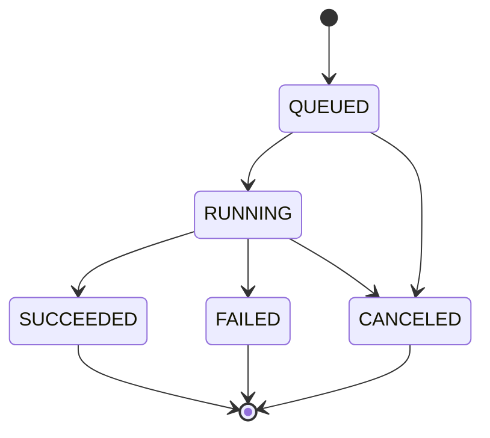

# ソフトウェア要求仕様書 (SRS)

## 犬種画像分類システム "FaunaLab"

本書は ISO/IEC/IEEE 29148:2018 の Annex C に示された文書構成に従う。

| 項目 | 内容 |
| --- | --- |
| 文書識別子 | SRS-FAUNALAB-002 |
| 版 | 2.2 |
| 状態 | 承認済 (基線化済) |
| 対象システム | FaunaLab — 犬種画像分類システム |
| 適用規格 | ISO/IEC/IEEE 29148:2018 |
| 想定読者 | 本システムを実装する者 |

### 改訂履歴

| 版 | 変更内容 |
| --- | --- |
| 1.0 から 1.3 | 初版から、ベースラインモデル、ラベル候補提示、犬種 8 クラス化、配布資産の規定までを段階的に追加 |
| 2.2 | 附属書 5.3 の固定入力のうち、現実には生じない誤分類 (`american_bulldog` を `samoyed` と予測) を含んでいた 1 件を修正。当該 1 件を `boxer` への誤分類へ移した。accuracy は 0.7778 で変わらない |
| 2.1 | 附属書 5.3 の固定入力を、ベースラインモデルのみで全要素を構成できる内容へ差し替え。予測件数が 0 のクラスにおける precision の規約を REQ-OBS-006 に追加 |
| 2.0 | 設計に関する記述を全面的に除去。API のパス、要求と応答の形式、エラーコード、内部の状態名、データベース構成、モジュール分割の規定を削除し、外部から観測できる振る舞いのみを要求とした。観測のための単一のエンドポイント (3.1.3) を新設。附属書のうち評価者向けの内容を本書から分離 |

本版において「ベースライン」の語は、文書の基線 (baseline) ではなく同梱の学習済モデルを指す。文書の版管理上の基線は「基線化済」と表記する。

---

## 1. 序論

### 1.1 目的 (Purpose)

本書は、犬種画像分類システム FaunaLab に対するソフトウェア要求を定義する。

本書は、システムが外部に対して示すべき振る舞いを規定する。その振る舞いをどのような構造、技術、命名によって実現するかは規定しない。API のパス、要求と応答の形式、内部で用いる状態や誤りの名称、データの保持方法、コンポーネントの分割は、いずれも実装者が決定する事項である。

例外は一つだけである。3.1.3 項が定める観測のためのエンドポイントは、システムの状態を外部から確認するために形式を固定する。これは実装の構造を規定するものではなく、システムが保持している状態を規定の語彙へ変換して提示することだけを求める。

### 1.2 適用範囲 (Scope)

本書が対象とするソフトウェア製品の名称は FaunaLab である。

FaunaLab が行うことは次のとおりである。

- 利用者がアップロードした犬の画像を保管し、一覧・検索できるようにする
- 各画像に対して、あらかじめ定義された犬種クラスのいずれか一つをラベルとして付与する
- ラベル付き画像を訓練用・検証用・試験用に分割する
- 画像分類モデルを非同期に学習させ、その進捗と結果を提示する
- 学習済モデルを版として管理し、そのうち一つを推論に使う版として有効化する
- 有効化されたモデルを用いて、新規画像に対する分類推論を実行し、結果を提示する
- 試験用分割に対する評価指標を算出する
- 同梱された ImageNet-1k 学習済分類器を用い、利用者による学習を経ずに推論を実行できるようにする。ただし対象犬種の一部は ImageNet-1k に含まれないため、この状態での精度はクラス間で不均一となる
- 未ラベル画像に対して候補ラベルを機械的に提示し、利用者による確認と訂正のみでアノテーションを完了できるようにする

FaunaLab が行わないことは次のとおりである。

- 物体検出、領域分割、複数ラベル分類 (分類は 1 画像 1 クラスに限定する)
- 複数利用者の同時利用、利用者アカウント管理、認証・認可
- インターネット上の外部サービスとの通信
- モデルの分散学習、GPU クラスタ上での学習
- 動画・音声の扱い

### 1.3 製品概要 (Product overview)

#### 1.3.1 製品の位置付け (Product perspective)

FaunaLab は既存システムの一部ではなく、単体で完結する自己完結型システムである。単一のホスト上で動作し、外部ネットワークへのアクセスを必要としない。

外部との接点は三つある。第一に、利用者が操作する Web UI。第二に、プログラムから操作するためのインタフェース (3.1.2)。第三に、状態を確認するための観測用エンドポイント (3.1.3) である。

配布資産 (3.1.4) は、システムの外部から与えられる読み取り専用の入力である。実装者はこれを生成せず、読み込むのみとする。

システムの内部構造は規定しない。ただし、状態の保持については次を満たさなければならない。

**REQ-SYS-001** (M, T)
Web UI はシステムの権威ある状態を保持してはならない。ブラウザをリロードした場合、および別のブラウザから接続した場合に、同一の状態が観測されなければならない。

**REQ-SYS-002** (M, T)
画像、アノテーション、分割、ジョブ、モデル版、有効モデルの選択、候補ラベル、推論履歴は、システムの再起動後も保持されなければならない。

#### 1.3.2 製品機能 (Product functions)

| 機能群 | 概要 |
| --- | --- |
| 画像管理 | 画像のアップロード、一覧表示、絞り込み、詳細表示、削除 |
| アノテーション | 単一クラスラベルの付与、一括付与、ラベル解除、未ラベル画像の抽出 |
| データセット管理 | 訓練 / 検証 / 試験への分割、分割統計の提示 |
| 学習 | 学習ジョブの起動、進捗監視、ログ参照、中止 |
| モデル管理 | モデル版の一覧、評価指標の参照、有効化、削除、再評価 |
| 推論 | 単一画像および複数画像に対する分類推論、推論履歴の参照 |
| ベースラインモデル | 同梱の ImageNet-1k 学習済分類器による、学習なしでの推論 |
| ラベル候補提示 | 未ラベル画像への候補ラベル生成、採用、却下、一括採用 |

#### 1.3.3 利用者の特性 (User characteristics)

利用者区分は一つのみであり、これを「オペレータ」と呼ぶ。オペレータは Web ブラウザの基本操作に習熟しており、画像分類の基礎概念 (ラベル、学習、エポック、正解率) を理解している。一方、コマンドライン操作、機械学習フレームワークの内部構造、および犬種の判別に関する知識は前提としない。

したがって、学習の起動や中止といった操作はすべて Web UI から完結しなければならず、設定ファイルの直接編集やコマンド実行を要求してはならない。また、未ラベル画像を目視で犬種に分類できることを前提としてはならない。

区分が一つであるため、役割に基づく権限の差は存在しない。

#### 1.3.4 制限事項 (Limitations)

- 同時に実行できる学習ジョブは 1 件に限る。2 件目以降は待ち行列に入る。
- 分類対象は 3.5.2 項で定義する固定 8 犬種に限る。クラスの追加・変更は本版の範囲外とする。
- 想定データ規模は画像 5,000 枚、モデル版 50 件までとする。これを超えた場合の性能は保証しない。
- 学習は CPU 上で実行できなければならない。GPU は存在すれば利用してよいが、必須としてはならない。
- 認証機構を持たないため、システムは信頼されたネットワーク内でのみ運用されることを前提とする。

### 1.4 用語の定義 (Definitions)

| 用語 | 定義 |
| --- | --- |
| 画像 | システムに登録された 1 枚の静止画像と、それに付随する情報。 |
| クラス | 分類先となる犬種のカテゴリ。本システムでは 8 種に固定する。 |
| 確定ラベル | 1 枚の画像に対して確定的に割り当てられた 1 つのクラス。学習および統計の対象となる。1 画像につき高々 1 件存在する。 |
| 候補ラベル | モデルが提示した未確定のラベル。学習、分割、ラベル付き件数の対象とならない。 |
| 分割 | 画像が属するデータセット区分。訓練用、検証用、試験用、未割当のいずれか。 |
| 学習ジョブ | 1 回の学習実行を表す非同期処理の単位。状態を持つ。 |
| モデル版 | 推論可能な成果物とその評価指標の組。 |
| ベースラインモデル | 配布資産として与えられる ImageNet-1k 学習済分類器と、そのクラスマッピングの組。モデル版 0 を占め、学習を経ずに推論へ利用できる。 |
| 有効モデル | 推論に使用されるモデル版。システム全体で同時に高々 1 件存在する。 |
| 混同ペア | 視覚的に類似し、誤分類が生じやすいものとして意図的に選定された 2 つのクラスの組。3.5.2 項を参照。 |
| 未収録犬種 | 本システムのクラスのうち、ImageNet-1k に対応するクラスを持たないもの。ベースラインモデルは当該犬種を予測しない。 |
| クラスマッピング | ImageNet-1k の 1000 クラスを本システムの 8 クラスへ対応付ける定義。配布資産として与えられる。 |
| その他質量 | ベースラインモデルの出力確率のうち、8 クラスのいずれにも対応付けられない分の合計。 |
| 信頼度 | 推論結果における各クラスの予測確率。8 クラスの合計は 1 に正規化される。 |
| オペレータ | 本システムの唯一の利用者区分。 |

要求文における助動詞は次の意味で用いる。「〜しなければならない」(shall) は必須、「〜することが望ましい」(should) は推奨、「〜してもよい」(may) は許容を表す。

---

## 2. 参照文書 (References)

| 識別子 | 文書 |
| --- | --- |
| [1] | ISO/IEC/IEEE 29148:2018, Systems and software engineering — Life cycle processes — Requirements engineering |
| [2] | IETF RFC 9110, HTTP Semantics |
| [3] | ISO/IEC 25010:2011, SQuaRE — System and software quality models |
| [4] | ISO 8601-1:2019, Date and time — Representations for information interchange |
| [5] | W3C Web Content Accessibility Guidelines (WCAG) 2.1 |
| [6] | OpenAPI Specification 3.1.0 |

---

## 3. 個別要求 (Specific requirements)

### 3.0 要求の記述規約

各要求は識別子、要求文、優先度、検証方法を持つ。優先度は M (必須)、S (重要)、C (任意) の 3 段階とする。検証方法の記号は 4 章で定義する。

本書の要求は、外部から観測できる振る舞いのみを規定する。実装者は次の事項を自由に決定してよく、本書はこれらについて一切の指定を行わない。

- 実装言語、フレームワーク、ライブラリ
- API のパス、HTTP メソッドの選び方、要求と応答の構造、フィールド名
- 誤りを表現する方法と、誤りの種類を表す識別子の語彙
- 内部で用いる状態の名称と表現
- データの保持方法、スキーマ、ファイル配置
- モジュール分割、クラス設計、処理の分担

本書が形式を固定するのは、3.1.3 項の観測用エンドポイントと、3.1.4 項の配布資産の二つのみである。前者は評価のための窓であり、後者は外部から与えられる入力である。いずれも実装の内部構造を規定しない。

### 3.1 外部インタフェース (External interfaces)

#### 3.1.1 利用者インタフェース

**REQ-UI-001** (M, D)
Web UI は、1.3.2 項の全機能を操作できる画面群を提供しなければならない。画面の分割、遷移、URL の構成は実装者が決定する。

**REQ-UI-002** (M, D)
各画面はブラウザの URL によって直接到達可能でなければならず、リロード後も同じ画面が表示されなければならない。

**REQ-UI-003** (M, D)
すべての機能へ、ナビゲーション要素を通じて到達できなければならない。

**REQ-UI-004** (M, D)
処理の完了に 300 ms を超える見込みがある操作について、UI は処理中であることを示し、かつ同一操作の多重実行を抑止しなければならない。

**REQ-UI-005** (M, D)
処理が失敗した場合、UI は失敗したこととその理由を利用者に提示しなければならない。失敗を無言で破棄してはならない。

**REQ-UI-006** (M, D)
UI は、データセットの概況 (総画像数、確定ラベル数、未ラベル数、候補ラベル数、クラス別件数、分割別件数)、有効モデルの状態、実行中または待機中の学習ジョブの有無を確認できなければならない。

**REQ-UI-007** (M, D)
UI は、有効モデルがベースラインモデルであるか学習済モデルであるかを区別して示さなければならない。有効モデルが存在しない場合は、その旨と考えられる原因を示さなければならない。

**REQ-UI-008** (M, D)
アップロード操作は、複数ファイルの同時選択を受け付けなければならない。各ファイルについて成功または失敗を個別に示し、一部の失敗が他のファイルの処理を妨げてはならない。

**REQ-UI-009** (S, D)
アップロード操作は、ドラッグアンドドロップによるファイル投入を受け付けることが望ましい。

**REQ-UI-010** (M, D)
アノテーション操作において、画像はサムネイルとして一覧でき、各画像の現在の確定ラベルと候補ラベルを視認できなければならない。確定ラベルと候補ラベルは視覚的に区別されなければならない。

**REQ-UI-011** (M, D)
アノテーション操作は、ラベル有無、クラス、分割による絞り込みを提供しなければならない。

**REQ-UI-012** (M, D)
アノテーション操作は、1 枚への確定ラベル付与と、複数枚への一括付与を提供しなければならない。付与後、表示は再読み込みなしに更新されなければならない。

**REQ-UI-013** (M, D)
アノテーション操作は、候補ラベルの生成、1 件ずつの採用と却下、および信頼度の閾値を指定した一括採用を提供しなければならない。

**REQ-UI-014** (S, D)
アノテーション操作は、候補ラベルを信頼度の昇順および降順で並べ替える手段を提供することが望ましい。既定は昇順とし、判断の難しい画像から順に提示する。

**REQ-UI-015** (S, D)
アノテーション操作は、キーボードによるラベル付与と画像移動を提供することが望ましい。

**REQ-UI-016** (M, D)
学習操作は、パラメータ (エポック数、バッチ数、学習率、乱数シード、データ拡張の有無、ベースラインの利用可否) の入力と、学習の開始を提供しなければならない。既定値は 3.2.4 項に従わなければならない。

**REQ-UI-017** (M, D)
学習操作は、ジョブの一覧を状態とともに示さなければならない。実行中のジョブについては、現在のエポック数と総エポック数、および直近のエポックの訓練損失と検証正解率を示さなければならない。

**REQ-UI-018** (M, D)
実行中または待機中のジョブがある間、表示は 5 秒以内の間隔で自動的に更新されなければならない。利用者が手動で再読み込みする必要があってはならない。

**REQ-UI-019** (M, D)
学習操作は、実行中または待機中のジョブを中止する手段を提供しなければならない。

**REQ-UI-020** (S, D)
学習操作は、ジョブのログを時系列で示さなければならない。

**REQ-UI-021** (M, D)
モデル操作は、モデル版の一覧を版番号、作成日時、試験正解率、有効か否かとともに示さなければならない。ベースラインモデルは版 0 として一覧に含め、内蔵であることを明示し、削除操作を提示してはならない。

**REQ-UI-022** (M, D)
モデル操作は、任意のモデル版の有効化と、試験用分割に対する再評価を提供しなければならない。

**REQ-UI-023** (M, D)
モデル操作は、選択したモデル版の混同行列とクラス別 precision / recall / F1 を示さなければならない。混同行列は行を正解クラス、列を予測クラスとする表として示さなければならない。

**REQ-UI-024** (M, D)
推論操作は、新規に画像ファイルを選択して推論する手段と、登録済画像を選択して推論する手段の双方を提供しなければならない。

**REQ-UI-025** (M, D)
推論結果として、最上位クラス、その信頼度、および上位 3 クラスの信頼度を示さなければならない。信頼度は百分率で小数第 1 位まで示さなければならない。

**REQ-UI-026** (M, D)
有効モデルが存在しない状態で推論を試みた場合、UI はその旨を利用者に提示しなければならない。

#### 3.1.2 プログラムインタフェース

**REQ-API-001** (M, T)
システムは、1.3.2 項の全機能を Web UI を介さずに実行できる HTTP インタフェースを提供しなければならない。Web UI がこのインタフェースを利用するか否かは問わない。

**REQ-API-002** (M, I)
システムは、上記インタフェースの仕様を OpenAPI 3.1 形式の文書として提供しなければならない。文書は実装と一致していなければならない。

**REQ-API-003** (M, T)
処理の結果は、RFC 9110 に定める HTTP ステータスコードによって区別できなければならない。少なくとも次の状況が、それぞれ異なる状況として区別できなければならない。要求内容の誤り、対象の不在、現在の状態では実行できない操作、前提条件の不成立、許可されない媒体型、上限を超える大きさ、およびシステム内部の予期しない誤り。

**REQ-API-004** (M, T)
誤りの応答には、誤りの種類を機械的に判別できる識別子と、利用者に提示できる説明を含めなければならない。識別子の語彙は実装者が定義し、REQ-API-002 の文書に記載しなければならない。

**REQ-API-005** (M, T)
誤りの応答に、スタックトレース、内部のファイルパス、データベースの問い合わせ文を含めてはならない。詳細はサーバのログにのみ記録しなければならない。

**REQ-API-006** (M, T)
一覧を返す操作は、件数の制限と位置の指定を受け付け、全体件数を併せて返さなければならない。同一条件での取得順序は常に一意でなければならない。

**REQ-API-007** (M, T)
Web UI が異なるオリジンで提供される場合、当該オリジンからの CORS 要求を許可しなければならない。許可するオリジンは環境変数で設定可能でなければならない。

#### 3.1.3 観測インタフェース

本項は、評価および外部からの状態確認のために設けられた唯一の形式固定インタフェースである。システムの内部表現を規定するものではなく、保持している状態を本項の語彙へ変換して提示することのみを求める。

**REQ-OBS-001** (M, T)
システムは `GET /api/_state` を提供しなければならない。当該エンドポイントは読み取り専用であり、いかなる状態変更も引き起こしてはならない。

**REQ-OBS-002** (M, T)
応答は `application/json` とし、次の構造でなければならない。記載されたキーはすべて必須とする。追加のキーを含めてもよい。

```json
{
  "schema_version": 1,
  "observed_at": "2026-09-12T03:04:05Z",
  "classes": [
    { "class_id": "samoyed", "display_order": 1 }
  ],
  "images": [
    {
      "ref": "任意の一意な文字列",
      "sha256": "e3b0c442...",
      "split": "train",
      "label": { "class_id": "samoyed", "source": "human" },
      "suggestion": null
    }
  ],
  "jobs": [
    {
      "ref": "任意の一意な文字列",
      "status": "RUNNING",
      "current_epoch": 3,
      "total_epochs": 10,
      "model_ref": null,
      "failed": false
    }
  ],
  "models": [
    {
      "ref": "任意の一意な文字列",
      "version": 0,
      "builtin": true,
      "active": true,
      "metrics": null
    }
  ],
  "inferences": [
    {
      "ref": "任意の一意な文字列",
      "image_ref": "...",
      "model_ref": "...",
      "top_class_id": "samoyed",
      "top_confidence": 0.912,
      "other_mass": 0.031,
      "low_confidence": false,
      "created_at": "2026-09-12T03:20:00Z"
    }
  ]
}
```

**REQ-OBS-003** (M, T)
`ref` は、システム内でその対象を一意に指す文字列とする。形式は実装者が決定してよい。ただし対象が存在する限り不変でなければならず、削除された対象の `ref` を再利用してはならない。

**REQ-OBS-004** (M, T)
`split` は `train`、`val`、`test`、`unassigned` のいずれかでなければならない。確定ラベルが存在しない画像の `label` は `null` でなければならない。`label.source` は `human` または `model_suggested` のいずれかでなければならない。候補ラベルが存在しない画像の `suggestion` は `null` でなければならない。存在する場合は `{ "class_id": ..., "confidence": ..., "model_ref": ... }` の形式とする。

**REQ-OBS-005** (M, T)
`status` は `QUEUED`、`RUNNING`、`SUCCEEDED`、`FAILED`、`CANCELED` のいずれかでなければならない。これらは観測上の語彙であり、システム内部で同じ名称を用いる必要はない。

**REQ-OBS-006** (M, T)
`metrics` は、評価が行われていない場合は `null` とし、行われている場合は次の形式でなければならない。`confusion_matrix.labels` の順序は `classes` の `display_order` の昇順と一致しなければならない。`matrix` は行が正解クラス、列が予測クラスである。

```json
{
  "accuracy": 0.8889,
  "per_class": {
    "samoyed": { "precision": 0.8889, "recall": 1.0, "f1": 0.9412, "support": 8 }
  },
  "confusion_matrix": {
    "labels": ["samoyed", "..."],
    "matrix": [[8, 0, 0, 0, 0, 0, 0, 0]]
  }
}
```

**REQ-OBS-006a** (M, T)
`per_class` は 3.5.2 項の 8 クラスすべてをキーとして持たなければならない。評価対象に含まれないクラスや、一度も予測されなかったクラスを省略してはならない。

当該クラスを予測した件数が 0 の場合、precision は 0.0 としなければならない。当該クラスの正解が 0 件の場合、recall は 0.0 としなければならない。precision と recall がともに 0.0 の場合、F1 は 0.0 としなければならない。

**REQ-OBS-007** (M, T)
`other_mass` は、ベースラインモデルによる推論では実数、学習済モデルによる推論では `null` でなければならない。

**REQ-OBS-008** (M, T)
1.3.4 項が定める想定規模において、応答は 5 秒以内に返されなければならない。

**REQ-OBS-009** (M, T)
`GET /api/_state` は、Web UI の操作によって生じた状態変化と、プログラムインタフェースの操作によって生じた状態変化を、区別なく反映しなければならない。

#### 3.1.4 配布資産

配布資産は、システムの外部から与えられる読み取り専用の入力である。実装者はこれを生成してはならず、読み込むのみとする。

**REQ-ASSET-001** (M, I)
配布資産は次の構成で与えられる。

```
assets/
  baseline/
    MANIFEST.json             資産の目録とハッシュ
    model.onnx                ベースライン重み
    class_map.json            ImageNet クラスから本システムのクラスへの対応
    imagenet_classes.json     ImageNet クラス索引と名称の対応
    ATTRIBUTION.md            出典表示
  fixtures/
    images/                   検証用画像
    baseline_expectations.json  ベースライン出力の期待値
    metrics_fixture.json        指標算出の固定入力 (附属書 5.3)
  sample/
    images/                   サンプルデータセットの画像
    manifest.json             画像とクラスの対応
```

`assets/` の位置は環境変数で変更可能でなければならない。

**REQ-ASSET-002** (M, T)
ベースライン重みは ONNX 形式 (opset 13 以上) で与えられる。入力は形状 `[N, 3, 224, 224]` の float32 が 1 つ、出力は ImageNet-1k の 1000 次元 (`logits`) と分類層直前の特徴ベクトル (`embedding`) の 2 つである。各名称と次元は `MANIFEST.json` に記載される。

**REQ-ASSET-003** (M, T)
`MANIFEST.json` は次の形式で与えられる。

```json
{
  "manifest_version": 1,
  "generated_at": "2026-09-12T00:00:00Z",
  "model": {
    "file": "model.onnx",
    "sha256": "...",
    "format": "onnx",
    "opset": 13,
    "input_name": "input",
    "input_shape": [1, 3, 224, 224],
    "logits_output_name": "logits",
    "embedding_output_name": "embedding",
    "embedding_dim": 1280,
    "source": "...",
    "license": "..."
  },
  "files": [
    { "file": "class_map.json", "sha256": "..." },
    { "file": "imagenet_classes.json", "sha256": "..." }
  ]
}
```

**REQ-ASSET-004** (M, T)
`class_map.json` は次の形式で与えられる。`classes` は 3.5.2 項の 8 クラスすべてをキーとして持ち、値は対応する ImageNet クラス索引の配列である。対応するクラスを持たないクラスの値は空配列である。

```json
{
  "map_version": 1,
  "model_file": "model.onnx",
  "generated_at": "2026-09-12T00:00:00Z",
  "classes": {
    "samoyed": [258],
    "american_bulldog": []
  },
  "notes": {}
}
```

**REQ-ASSET-005** (M, T)
`baseline_expectations.json` は次の形式で与えられる。`margin` は最上位クラスと第 2 位クラスの信頼度の差である。

```json
{
  "expectations_version": 1,
  "model_sha256": "...",
  "class_map_sha256": "...",
  "items": [
    {
      "file": "images/samoyed_01.jpg",
      "expected_top_class_id": "samoyed",
      "expected_top_confidence": 0.9412,
      "margin": 0.8123
    }
  ]
}
```

**REQ-ASSET-006** (M, T)
`metrics_fixture.json` は次の形式で与えられる。`assigned_class_id` は当該画像へ確定ラベルとして付与すべきクラス、`baseline_predicts` はベースラインモデルが予測するクラスである。

```json
{
  "fixture_version": 1,
  "items": [
    {
      "file": "images/fixture_001.jpg",
      "assigned_class_id": "great_pyrenees",
      "baseline_predicts": "samoyed"
    }
  ]
}
```

**REQ-ASSET-007** (M, T)
`sample/manifest.json` は次の形式で与えられる。

```json
{
  "manifest_version": 1,
  "source": "...",
  "license": "...",
  "items": [
    { "file": "images/samoyed_0001.jpg", "class_id": "samoyed" }
  ]
}
```

#### 3.1.5 ハードウェアインタフェース

**REQ-HW-001** (M, A)
本システムは専用のハードウェア装置とのインタフェースを持たない。標準的な x86_64 または arm64 の計算機上で動作しなければならない。

**REQ-HW-002** (M, T)
本システムは、4 論理 CPU コア、メモリ 8 GB、空きディスク 10 GB の環境で、3.4 節の性能要求を満たして動作しなければならない。GPU の有無に依存してはならない。

#### 3.1.6 通信インタフェース

**REQ-COM-001** (M, T)
システムは HTTP/1.1 で待ち受けなければならない。既定のポートは 8000 とし、環境変数で変更可能としなければならない。

**REQ-COM-002** (M, T)
システムは、起動後の通常動作において、ループバックインタフェースおよび同一ホスト内通信を除く外部ネットワーク通信を行ってはならない。

### 3.2 機能要求 (Functions)

#### 3.2.1 画像管理

**REQ-F-IMG-001** (M, T)
システムは JPEG 形式および PNG 形式の画像を受理しなければならない。

**REQ-F-IMG-002** (M, T)
システムは、ファイル拡張子ではなく内容によって形式を判定しなければならない。判定結果が許可形式でない場合、受理してはならない。

**REQ-F-IMG-003** (M, T)
1 ファイルのサイズ上限は 10 MiB とする。超過した場合は受理してはならない。

**REQ-F-IMG-004** (M, T)
1 回のアップロード操作で最大 50 ファイルを受け付けなければならない。

**REQ-F-IMG-005** (M, T)
複数ファイルのアップロードにおいて一部が失敗した場合、成功したファイルを登録したうえで、ファイルごとの結果を呼び出し元が判別できる形で返さなければならない。1 件でも成功していれば、操作全体を失敗として扱ってはならない。

**REQ-F-IMG-006** (M, T)
システムは各画像の SHA-256 を算出し保持しなければならない。既に同一の SHA-256 を持つ画像が登録されている場合、新たな画像を登録してはならず、重複であることを判別できる形で失敗を返さなければならない。

**REQ-F-IMG-007** (M, T)
システムは各画像について、長辺 256 ピクセル以下、アスペクト比を保持したサムネイルを提供しなければならない。

**REQ-F-IMG-008** (M, T)
画像の一覧取得は、分割、クラス、確定ラベルの有無による絞り込みを受け付けなければならない。複数指定された場合は論理積としなければならない。

**REQ-F-IMG-009** (M, T)
画像の削除時、当該画像の確定ラベル、候補ラベル、推論履歴が併せて削除され、画像ファイルとサムネイルが記憶域から除去されなければならない。既に学習に使用されたモデル版は削除の影響を受けてはならない。

#### 3.2.2 アノテーション

**REQ-F-ANN-001** (M, T)
システムは 1 枚の画像に対し、3.5.2 項のクラスのうち高々 1 つを確定ラベルとして割り当てられなければならない。

**REQ-F-ANN-002** (M, T)
既に確定ラベルを持つ画像への付与は、既存のラベルを上書きしなければならない。失敗としてはならない。

**REQ-F-ANN-003** (M, T)
確定ラベルの付与および更新時に、付与時刻を現在時刻で更新しなければならない。

**REQ-F-ANN-004** (M, T)
一括付与は、指定された全画像に同一クラスを割り当てなければならない。存在しない画像が 1 件でも含まれる場合、いかなる画像も更新せずに失敗しなければならない。

**REQ-F-ANN-005** (M, T)
一括付与の成功時、更新された件数を呼び出し元が判別できる形で返さなければならない。

**REQ-F-ANN-006** (M, T)
確定ラベルは由来を保持しなければならない。利用者が直接付与した場合の由来は `human`、候補ラベルの採用による場合の由来は `model_suggested` とする (REQ-OBS-004)。

**REQ-F-ANN-007** (M, T)
確定ラベルが付与された時点で、当該画像の候補ラベルが存在する場合はこれを削除しなければならない。1 枚の画像が確定ラベルと候補ラベルを同時に持ってはならない。

#### 3.2.3 データセット分割

**REQ-F-DS-001** (M, T)
分割操作は、訓練用、検証用、試験用の比率と乱数シードを受け取り、確定ラベルを持つ画像を 3 つの分割に割り当てなければならない。既定値は 0.7 / 0.15 / 0.15、シードは 42 とする。

**REQ-F-DS-002** (M, T)
分割は層化抽出でなければならない。各クラスについて、そのクラスの画像数に対する各分割の比率が、指定比率から ±1 枚の範囲に収まらなければならない。

**REQ-F-DS-003** (M, T)
分割は乱数シードに対して決定的でなければならない。同一の画像集合と同一のシードに対して、分割結果は常に同一でなければならない。

**REQ-F-DS-004** (M, T)
確定ラベルを持たない画像は分割の対象外とし、未割当のまま保持しなければならない。

**REQ-F-DS-005** (M, T)
システムは、総画像数、確定ラベル数、未ラベル数、候補ラベル数、クラス別件数、分割別件数を取得できなければならない。確定ラベル数に、候補ラベルのみを持つ画像を含めてはならない。

#### 3.2.4 学習

**REQ-F-TRN-001** (M, T)
学習の開始要求は、学習の完了を待たずに直ちに応答しなければならない。

**REQ-F-TRN-002** (M, T)
学習パラメータの既定値は、エポック数 10、バッチ数 32、学習率 0.001、シード 42、データ拡張あり、ベースライン利用ありでなければならない。省略されたパラメータには既定値を適用しなければならない。

**REQ-F-TRN-003** (M, T)
ベースライン利用が指定された場合、システムは配布資産のベースライン重みを用いて学習しなければならない。ベースライン資産が利用できない状態でこの指定を受けた場合、学習を開始してはならない。ベースライン利用が指定されない場合、ベースライン資産を使用してはならない。

**REQ-F-TRN-004** (M, T)
学習の開始には次の条件をすべて満たさなければならない。判定には確定ラベルのみを用い、候補ラベルを算入してはならない。

- 訓練用分割の確定ラベル付き画像が、ベースライン利用ありの場合は 10 枚以上、なしの場合は 50 枚以上であること
- 検証用分割の確定ラベル付き画像が 1 枚以上であること
- 訓練用分割に 2 つ以上の異なるクラスが含まれること

**REQ-F-TRN-005** (M, T)
待機中または実行中のジョブが既に存在する場合、新たなジョブは待機状態で登録されなければならない。同時に実行状態となるジョブは高々 1 件でなければならない。

**REQ-F-TRN-006** (M, T)
学習ジョブの状態は、REQ-OBS-005 が定める 5 つの観測上の状態のいずれかに対応しなければならない。状態遷移は次の経路のみ許される。終端状態からの遷移は存在しない。



**REQ-F-TRN-007** (M, T)
終端状態のジョブに対する中止要求は失敗しなければならない。

**REQ-F-TRN-008** (M, T)
実行中のジョブに対する中止要求を受理した場合、システムは 10 秒以内に当該ジョブを中止状態へ遷移させなければならない。中止されたジョブはモデル版を生成してはならない。

**REQ-F-TRN-009** (M, T)
学習中、システムは各エポックの完了時に進捗と直近の指標を更新しなければならない。更新は次のエポックの完了を待たずに外部から観測可能でなければならない。

**REQ-F-TRN-010** (M, T)
システムは各エポックについて、エポック番号、訓練損失、検証損失、検証正解率、所要時間を含むログを記録し、外部から時系列で取得できなければならない。

**REQ-F-TRN-011** (M, T)
学習が成功した場合、システムはモデル版を 1 件生成し、当該ジョブと対応付けなければならない。

**REQ-F-TRN-012** (M, T)
学習が失敗した場合、失敗状態とし、原因を示す情報を保持しなければならない。ジョブの失敗によってシステムが停止してはならない。

**REQ-F-TRN-013** (M, T)
同一のデータセット、同一のシード、同一のパラメータで 2 回学習した場合、生成されるモデルの試験正解率は完全に一致するか、または 0.02 以内の差でなければならない。シードは学習に関与するすべての乱数源に適用しなければならない。

**REQ-F-TRN-014** (M, T)
システムの再起動時、実行状態のまま残存するジョブが存在する場合、これを失敗状態へ遷移させ、中断された旨を保持しなければならない。実行状態のまま放置してはならない。

**REQ-F-TRN-015** (S, T)
データ拡張ありの場合、訓練データに対して左右反転とランダム切り出しを適用しなければならない。検証データおよび試験データには適用してはならない。

**REQ-F-TRN-016** (M, T)
学習、評価、推論に用いる基本前処理は、REQ-F-BASE-002 が定める共通前処理と一致しなければならない。データ拡張は共通前処理に対する追加としてのみ適用してよい。

**REQ-F-TRN-017** (M, T)
学習に用いるデータは確定ラベルを持つ画像に限らなければならない。候補ラベルを訓練データ、検証データ、試験データのいずれにも含めてはならない。

#### 3.2.5 モデル管理

**REQ-F-MDL-001** (M, T)
モデル版 0 はベースラインモデルのために予約しなければならない。学習が生成するモデル版には 1 から始まる連番を付与しなければならない。番号は再利用してはならない。

**REQ-F-MDL-002** (M, T)
モデル版の生成時、当該モデルを試験用分割に対して評価し、指標を保持しなければならない。試験用分割が空の場合、指標を持たないモデル版として生成を成功させなければならない。

**REQ-F-MDL-003** (M, T)
評価指標は、全体正解率、クラス別 precision / recall / F1 / support、および混同行列を含まなければならない (REQ-OBS-006)。

**REQ-F-MDL-004** (M, T)
学習によって生成された最初のモデル版が、有効モデルがベースラインモデルであるか、または有効モデルが存在しない状態で生成された場合、システムはこれを自動的に有効モデルとしなければならない。それ以外の場合は自動的に有効化してはならない。

**REQ-F-MDL-005** (M, T)
モデル版の有効化は、それまでの有効モデルを無効としなければならない。有効モデルは常に高々 1 件でなければならない。

**REQ-F-MDL-006** (M, T)
有効モデルに対する削除要求は失敗しなければならない。ベースラインモデルに対する削除要求は、有効か否かにかかわらず失敗しなければならない。

**REQ-F-MDL-007** (M, T)
モデル版の削除時、その成果物を記憶域から除去しなければならない。当該モデルによる推論履歴は保持しなければならない。

**REQ-F-MDL-008** (M, T)
有効モデルの選択はシステムの再起動後も保持されなければならない。

**REQ-F-MDL-009** (M, T)
システムは、指定されたモデル版を現在の試験用分割に対して再評価し、指標を更新する手段を提供しなければならない。ベースラインモデルに対しても実行可能でなければならない。試験用分割が空の場合は失敗しなければならない。

#### 3.2.6 推論

**REQ-F-INF-001** (M, T)
推論は、新規画像の投入による実行と、登録済画像の指定による実行の双方を受理しなければならない。

**REQ-F-INF-002** (M, T)
1 回の要求で最大 20 枚の画像を処理しなければならない。

**REQ-F-INF-003** (M, T)
有効モデルが存在しない状態での推論要求は失敗しなければならない。

**REQ-F-INF-004** (M, T)
推論に用いる前処理は、学習時に検証データへ適用した前処理と一致しなければならない。

**REQ-F-INF-005** (M, T)
推論結果は永続化し、外部から時系列で取得できなければならない。

**REQ-F-INF-006** (M, T)
新規投入された画像は、推論履歴を保持するために画像として登録されなければならない。当該画像の分割は未割当、確定ラベルは無しでなければならない。

**REQ-F-INF-007** (M, T)
推論結果には、使用したモデル版を記録しなければならない。有効モデルが後に変更されても、過去の推論結果が指すモデル版が変化してはならない。

**REQ-F-INF-008** (M, T)
推論結果は全 8 クラスの信頼度を含み、信頼度の降順に整列していなければならない。信頼度の総和は 1.0 に対して誤差 0.001 以内でなければならない。

**REQ-F-INF-009** (M, T)
次のいずれかに該当する場合、低信頼と判定しなければならない。閾値は環境変数で設定可能でなければならない。

- 最上位クラスの信頼度が信頼度閾値 (既定値 0.5) を下回る
- その他質量がその他質量閾値 (既定値 0.5) を上回る

#### 3.2.7 ベースラインモデル

**REQ-F-BASE-001** (M, T)
システムは配布資産のベースライン重みをモデル版 0 として登録し、内蔵モデルとして扱わなければならない。当該モデル版は学習ジョブと対応付かない。

**REQ-F-BASE-002** (M, T)
共通前処理は次の順序で行わなければならない。この前処理は推論、学習、評価のすべてに適用される。

1. 画像を RGB 3 チャネルへ変換する。グレースケール画像は 3 チャネルへ複製し、アルファチャネルは破棄する。
2. アスペクト比を保持したまま、短辺が 256 画素となるよう bilinear 補間 (antialias 有効) で拡大縮小する。
3. 中央から 224 × 224 画素を切り出す。
4. 画素値を 0.0 以上 1.0 以下の浮動小数へ変換する。
5. チャネルごとに平均 (0.485, 0.456, 0.406)、標準偏差 (0.229, 0.224, 0.225) で正規化する。

**REQ-F-BASE-003** (M, T)
ベースラインモデルによる推論は次の畳み込み規則に従わなければならない。

1. 1000 次元の `logits` 出力に softmax を適用し、確率 p(i) を得る。
2. 本システムの各クラス c について、クラスマッピングが c に対応付ける ImageNet クラスの確率を合算し、s(c) を得る。合算は総和とし、最大値を採ってはならない。
3. その他質量を 1 − Σ s(c) とする。
4. Σ s(c) が 1e-6 以上の場合、各クラスの信頼度を s(c) / Σ s(c) とする。1e-6 未満の場合、全クラスの信頼度を 0.125 とし、低信頼と判定しなければならない。

**REQ-F-BASE-004** (M, T)
クラスマッピングが 1 つも ImageNet クラスを対応付けないクラスが存在してよい。当該クラスの s(c) は常に 0 となり、ベースラインモデルはこのクラスを予測しない。これは欠陥ではなく、3.5.2 項が定める意図された構成である。当該クラスに確率を割り当てるための補間や下限値を導入してはならない。

**REQ-F-BASE-005** (M, T)
システムは起動時に、`MANIFEST.json` に記載されたすべてのファイルについて SHA-256 を照合しなければならない。また `class_map.json` の `classes` のキー集合が 3.5.2 項のクラス集合と一致すること、および同一の ImageNet クラス索引が 2 つ以上のクラスへ対応付けられていないことを確認しなければならない。

**REQ-F-BASE-006** (M, T)
前項の確認が 1 件でも満たされない場合、またはベースライン資産が存在しない場合、システムはモデル版 0 を登録せず、警告をログに記録したうえで起動を継続しなければならない。起動を失敗させてはならない。この状態では有効モデルが存在せず、推論は REQ-F-INF-003 に従って失敗する。

**REQ-F-BASE-007** (M, T)
モデル版 0 が登録され、かつ有効モデルが未設定である場合、システムはモデル版 0 を有効モデルとしなければならない。

**REQ-F-BASE-008** (M, T)
システムは、REQ-F-BASE-003 が定める再正規化以外の確率補正を行ってはならない。温度スケーリング、クラス事前確率の補正、信頼度の下限切り上げなどを適用してはならない。

**REQ-F-BASE-009** (M, T)
クラスマッピングは配布資産の定義ファイルから読み込まなければならない。対応関係をソースコード内に直接記述してはならない。

**REQ-F-BASE-010** (M, T)
`baseline_expectations.json` に記載された各画像について、ベースラインモデルによる推論の最上位クラスが期待値と一致し、その信頼度が期待値との差 0.02 以内でなければならない。

**REQ-F-BASE-011** (M, T)
システムは実行時に `assets/` 配下へ書き込みを行ってはならない。

#### 3.2.8 ラベル候補提示

**REQ-F-SUG-001** (M, T)
システムは、指定した画像群、または未ラベル画像の集合に対して、候補ラベルを生成する手段を提供しなければならない。

**REQ-F-SUG-002** (M, T)
1 回の要求で処理する画像は最大 100 枚としなければならない。

**REQ-F-SUG-003** (M, T)
候補ラベルの生成対象は、確定ラベルを持たない画像に限らなければならない。確定ラベルを持つ画像が指定に含まれる場合、当該画像を処理せずに読み飛ばし、読み飛ばした件数を呼び出し元が判別できる形で返さなければならない。要求全体を失敗させてはならない。

**REQ-F-SUG-004** (M, T)
候補ラベルの生成には有効モデルを用いなければならない。有効モデルが存在しない場合は失敗しなければならない。生成された候補ラベルには、用いたモデル版と最上位クラスの信頼度を記録しなければならない。

**REQ-F-SUG-005** (M, T)
1 枚の画像が持つ候補ラベルは高々 1 件でなければならない。既に候補ラベルを持つ画像に対する生成は、既存の候補を上書きしなければならない。

**REQ-F-SUG-006** (M, T)
候補ラベルの一覧取得は、信頼度の範囲による絞り込みと、信頼度の昇順および降順の並べ替えを受け付けなければならない。

**REQ-F-SUG-007** (M, T)
候補ラベルの採用は、指定した画像群に対する採用と、信頼度の閾値を指定した一括採用の双方を提供しなければならない。

**REQ-F-SUG-008** (M, T)
候補ラベルの採用により、当該画像に確定ラベルを由来 `model_suggested` として付与し、候補ラベルを削除しなければならない。採用された件数を呼び出し元が判別できる形で返さなければならない。

**REQ-F-SUG-009** (M, T)
候補ラベルの却下は、当該候補ラベルを削除しなければならない。対象が存在しない場合は失敗しなければならない。

**REQ-F-SUG-010** (M, T)
画像が削除された場合、当該画像の候補ラベルも削除されなければならない。

#### 3.2.9 システム機能

**REQ-F-SYS-001** (M, T)
システムは初回起動時に、3.5.2 項の 8 クラスを自動的に登録しなければならない。利用者による事前準備を必要としてはならない。

**REQ-F-SYS-002** (M, T)
システムは初回起動時に、必要な記憶域を自動的に用意しなければならない。

**REQ-F-SYS-003** (M, T)
システムは、`assets/sample/manifest.json` を読み込み、記載された画像を登録して確定ラベルを付与する投入手段を提供しなければならない。手段はスクリプトまたは API のいずれでもよい。付与される確定ラベルの由来は `human` とする。`assets/sample/` が存在しない場合、投入手段は明確な誤りを示して終了し、システム全体の起動には影響してはならない。

### 3.3 ユーザビリティ要求 (Usability requirements)

**REQ-USE-001** (M, D)
機械学習の実務経験および犬種の知識を持たないオペレータが、本書以外の説明を受けずに、サンプルデータの投入、ラベル候補の生成と採用、学習の実行、推論結果の確認までを 15 分以内に完了できなければならない。

犬種の判別には専門的な知識が必要であり、オペレータが未ラベル画像を目視で分類できることを前提としてはならない。人手による 1 枚ずつのラベル付与を必須手順とする設計は、この要求に適合しない。

**REQ-USE-002** (M, D)
破壊的操作 (画像削除、モデル削除、学習中止) は、実行前に確認を求めなければならない。

**REQ-USE-003** (M, D)
データが存在しない状態の各画面は、空白ではなく、次に何をすべきかを示す文言を表示しなければならない。

**REQ-USE-004** (S, D)
すべての操作要素はキーボードのみで到達および実行が可能であることが望ましい。

**REQ-USE-005** (S, D)
文字と背景のコントラスト比は WCAG 2.1 の AA 基準を満たすことが望ましい。

**REQ-USE-006** (S, D)
UI の表示言語は日本語とする。クラス名は日本語表示名を用いる。

### 3.4 性能要求 (Performance requirements)

測定条件は 3.1.5 項の基準環境とし、データ規模は画像 1,000 枚とする。応答時間はサーバ内部での処理時間とし、ネットワーク遅延を含まない。

**REQ-PERF-001** (M, T)
50 件の画像一覧取得の応答時間は、95 パーセンタイルで 300 ms 以下でなければならない。

**REQ-PERF-002** (M, T)
5 MiB の JPEG 1 枚のアップロード処理は 2 秒以内に完了しなければならない。

**REQ-PERF-003** (M, T)
単一画像に対する推論の応答時間は、95 パーセンタイルで 1,000 ms 以下でなければならない。

**REQ-PERF-004** (M, T)
画像 1,000 枚、10 エポックの学習は、基準環境において 30 分以内に完了しなければならない。

**REQ-PERF-005** (M, T)
学習ジョブの実行中も、システムは他の要求に応答し続けなければならない。学習中における状態取得の応答時間は 5 秒以下でなければならない。

**REQ-PERF-006** (M, T)
常駐メモリ使用量は、学習を実行していない状態で 1 GiB を超えてはならない。

**REQ-PERF-007** (M, T)
システムは 10 並列の読み取り要求を処理でき、その際に失敗を返してはならない。

### 3.5 データ要求 (Data requirements)

本節は保持すべき情報と、常に成立すべき不変条件を定める。情報の保持方法は規定しない。

#### 3.5.1 保持すべき情報

**REQ-DATA-001** (M, T)
システムは次の情報を保持しなければならない。画像 (内容、由来する名称、大きさ、寸法、SHA-256、分割、登録時刻)、確定ラベル (クラス、由来、付与時刻)、候補ラベル (クラス、信頼度、提示したモデル版、生成時刻)、学習ジョブ (状態、パラメータ、進捗、指標、失敗原因、各時刻)、モデル版 (版番号、内蔵か否か、成果物、評価指標、有効か否か、作成時刻)、推論結果 (対象画像、使用モデル版、全クラスの信頼度、所要時間、生成時刻)。

#### 3.5.2 クラス定義

**REQ-DATA-002** (M, T)
クラスは次の 8 件に固定し、表示順は `display_order` の昇順でなければならない。

| class_id | display_name | display_order | 混同ペア | ImageNet-1k |
| --- | --- | --- | --- | --- |
| `samoyed` | サモエド | 1 | A | 収録 |
| `great_pyrenees` | グレート・ピレニーズ | 2 | A | 収録 |
| `boxer` | ボクサー | 3 | B | 収録 |
| `american_bulldog` | アメリカン・ブルドッグ | 4 | B | 未収録 |
| `chihuahua` | チワワ | 5 | C | 収録 |
| `miniature_pinscher` | ミニチュア・ピンシャー | 6 | C | 収録 |
| `pomeranian` | ポメラニアン | 7 | D | 収録 |
| `havanese` | ハバニーズ | 8 | D | 未収録 |

混同ペアと ImageNet-1k の欄は説明のための情報である。

##### 3.5.2.1 クラス選定の根拠

この 8 クラスは次の三つの性質を同時に満たすよう選定されている。仕様を変更する場合、いずれの性質が失われるかを確認する必要がある。

第一に、混同ペアの内部で誤分類が生じる。ペア A は大型・白色・長毛、ペア B は中型・短毛・筋肉質で吻が短い、ペア C は超小型・短毛で体色が近い、ペア D は小型・長毛という共通点を持つ。粗粒度の分類では混同行列がほぼ対角行列となり、行と列を取り違えた実装を評価で検出できない。非対角成分が安定して現れることが、この検出を可能にする。

第二に、クラスごとにベースラインモデルの精度が大きく異なる。`american_bulldog` と `havanese` は ImageNet-1k に対応するクラスを持たないため、ベースラインモデルはこれらを予測しない。学習による改善は全体正解率よりもクラス別の指標に現れる。

第三に、クラス数が 8 に収まる。上限はキーボード操作と混同行列の表示可能性から、下限は検証の強度と偶然水準 (8 クラスで 0.125) から決まる。

`display_order` はペアが隣接するよう並べてある。この順序で混同行列を描くと、対角線上に 2 × 2 の塊が並び、意図した混同が生じているかを目視で確認しやすい。

#### 3.5.3 不変条件

次の条件は、いかなる操作の後にも成立していなければならない。成立の保証手段は規定しない。

**REQ-DATA-003** (M, T)
同一の SHA-256 を持つ画像が 2 件以上存在してはならない。

**REQ-DATA-004** (M, T)
1 枚の画像が 2 件以上の確定ラベルを持ってはならない。

**REQ-DATA-005** (M, T)
1 枚の画像が 2 件以上の候補ラベルを持ってはならない。

**REQ-DATA-006** (M, T)
1 枚の画像が確定ラベルと候補ラベルを同時に持ってはならない。

**REQ-DATA-007** (M, T)
有効なモデル版が 2 件以上存在してはならない。

**REQ-DATA-008** (M, T)
内蔵のモデル版が 2 件以上存在してはならない。内蔵のモデル版の版番号は 0 でなければならず、版番号 0 のモデル版が他に存在してはならない。

**REQ-DATA-009** (M, T)
存在しない画像を参照する確定ラベル、候補ラベル、推論結果が存在してはならない。

**REQ-DATA-010** (M, T)
学習ジョブの履歴は、対応するモデル版が削除された後も保持されなければならない。

#### 3.5.4 記憶域

**REQ-DATA-011** (M, T)
システムが実行時に生成するすべてのファイルは、単一の基底ディレクトリの配下に置かれなければならない。当該ディレクトリの位置は環境変数で変更可能でなければならない。

**REQ-DATA-012** (M, T)
システムは、上記基底ディレクトリおよび `assets/` の外部へファイルを書き込んではならない。

### 3.6 設計上の制約 (Design constraints)

本節は、外部の事情によって解が制約される事項を定める。

**REQ-CON-001** (M, I)
本システムはセットアップ段階と実行段階を分離しなければならない。セットアップ段階ではネットワーク接続を利用してよい。実行段階、すなわちシステムの起動以降は、ネットワーク接続がない環境で全機能が動作しなければならない。起動時または学習時に外部からの資産取得を行ってはならない。

**REQ-CON-002** (M, T)
システム全体は、リポジトリ直下で単一のコマンドを実行することで起動可能でなければならない。起動手順は README に記載しなければならない。

**REQ-CON-003** (M, I)
依存するライブラリは、OSI 承認のオープンソースライセンス、またはこれと同等以上に許諾的なライセンスのものに限らなければならない。

**REQ-CON-004** (M, I)
実行環境は Linux (x86_64 / arm64) および macOS で動作しなければならない。Windows 対応は任意とする。

**REQ-CON-005** (M, T)
設定値 (待受ポート、資産ディレクトリ、データディレクトリ、CORS 許可オリジン、信頼度閾値、その他質量閾値) は環境変数から与えられなければならない。ソースコードの変更を必要としてはならない。

**REQ-CON-006** (M, I)
機密情報をリポジトリに含めてはならない。

**REQ-CON-007** (M, T)
`assets/` が存在しない状態でも、システムは起動し、ベースラインモデルを必要としない機能 (画像管理、アノテーション、分割、ベースライン利用なしの学習) が動作しなければならない。

**REQ-CON-008** (M, T)
サンプルデータを用いた学習において、試験正解率が偶然水準 (0.125) を有意に上回ることを確認できなければならない。

### 3.7 システム属性 (Software system attributes)

#### 3.7.1 信頼性

**REQ-ATT-REL-001** (M, T)
いかなる要求も、未処理の例外によってサーバプロセスを終了させてはならない。

**REQ-ATT-REL-002** (M, T)
学習ジョブ実行中にプロセスが異常終了した場合でも、再起動後に 3.5.3 項の不変条件がすべて成立していなければならない。

**REQ-ATT-REL-003** (M, T)
デコードできない画像ファイルを投入した場合、システムはこれを拒否し、処理を継続しなければならない。

#### 3.7.2 可用性

**REQ-ATT-AVL-001** (M, T)
システムは、学習ジョブの実行によって応答不能になってはならない。

#### 3.7.3 セキュリティ

**REQ-ATT-SEC-001** (M, T)
利用者が与えた文字列によって、3.5.4 項が定める範囲外のファイルが読み書きされてはならない。相対参照を含むファイル名を投入しても、範囲外にファイルが生成されてはならない。

**REQ-ATT-SEC-002** (M, T)
アップロードされたファイルが実行されてはならない。

**REQ-ATT-SEC-003** (M, T)
利用者が与えた文字列によって、システムのデータ操作の意味が変更されてはならない。構文的に特殊な文字列を含む入力を与えても、当該文字列は値として扱われなければならない。

**REQ-ATT-SEC-004** (M, T)
利用者由来の文字列を画面に表示する際、HTML として解釈させてはならない。

**REQ-ATT-SEC-005** (M, T)
ファイルサイズおよび件数の上限は、本体を全量メモリへ読み込む前に判定しなければならない。

#### 3.7.4 保守性

**REQ-ATT-MNT-001** (M, T)
自動試験を備えなければならない。行カバレッジは 70 % 以上でなければならない。

**REQ-ATT-MNT-002** (M, T)
試験は単一のコマンドで実行可能でなければならず、外部ネットワークに依存してはならない。

**REQ-ATT-MNT-003** (M, I)
静的解析ツールおよび整形ツールの設定をリポジトリに含め、違反なく通過しなければならない。

**REQ-ATT-MNT-004** (M, I)
README に、前提環境、起動手順、試験実行手順、サンプルデータ投入手順、および主要な設計判断とその根拠を記載しなければならない。

#### 3.7.5 移植性

**REQ-ATT-POR-001** (M, T)
データディレクトリを別ホストへ複製し、同一版のシステムを起動した場合、画像、確定ラベル、候補ラベル、モデル版、有効モデルの選択が復元されなければならない。

**REQ-ATT-POR-002** (S, I)
コンテナイメージ定義を提供することが望ましい。

### 3.8 補足情報 (Supporting information)

本書の要求は、機能群ごとに独立して実装・検証できるよう構成している。画像管理とアノテーションはデータセット分割の前提であり、分割は学習の前提であり、学習はモデル管理の前提である。

推論はこの連鎖から外れる。ベースラインモデルが配布資産として与えられるため、推論は画像管理の直後に実装・検証できる。ラベル候補提示は推論とアノテーションの双方に依存するが、学習には依存しない。したがって、学習機能が未完成の段階でも、画像管理から推論、候補提示までの経路を独立して検証できる。

---

## 4. 検証 (Verification)

### 4.0 検証方法の定義

| 記号 | 方法 | 内容 |
| --- | --- | --- |
| I | 検査 | 成果物、設定、文書を目視または静的に確認する |
| A | 解析 | 設計、計算、論証によって適合を示す |
| D | 実証 | 実際に操作し、期待される振る舞いを観察する |
| T | 試験 | 定義された入力を与え、出力を機械的に照合する |

本書は API の形式を固定しないため、試験は次の方針で行う。状態を変更する操作は Web UI の自動操作によって行い、結果の確認は `GET /api/_state` (3.1.3) によって行う。プログラムインタフェース (3.1.2) を用いた操作は、提出された OpenAPI 文書に基づいて行う。

### 4.1 外部インタフェースの検証

**VER-OBS-001** (REQ-OBS-001 から REQ-OBS-009 に対応)
`GET /api/_state` を呼び出し、応答が REQ-OBS-002 の構造に適合すること、および列挙値が規定の語彙に収まることを機械的に照合する。呼び出しの前後で状態が変化しないことを、連続 2 回の呼び出し結果の一致によって確認する。Web UI から操作を行った後に呼び出し、変化が反映されることを確認する。

**VER-API-001** (REQ-API-001 から REQ-API-005 に対応)
提出された OpenAPI 文書に記載されたすべての操作を呼び出し、実装が文書と一致することを確認する。REQ-API-003 が列挙する各状況を意図的に発生させ、返却されるステータスコードが互いに区別できることを確認する。意図的に例外を発生させ、応答本体にファイルパスおよびスタックトレースに相当する文字列が含まれないことを確認する。

**VER-UI-001** (REQ-UI-001 から REQ-UI-026 に対応)
ブラウザ上で全機能を操作し、URL による直接到達とリロード後の表示保持を実証する。学習については、ジョブ実行中に手動操作なしで表示が更新されることを 5 秒以上観察して確認する。

**VER-COM-001** (REQ-COM-002 に対応)
外部ネットワークを遮断した環境でシステムを起動し、サンプルデータ投入、学習、推論の一連の操作が完了することを確認する。

### 4.2 機能要求の検証

**VER-F-IMG-001** (REQ-F-IMG-001 から REQ-F-IMG-003 に対応)
JPEG、PNG、拡張子のみを偽装したテキストファイル、10 MiB を超える JPEG の 4 種を投入し、前二者のみが登録されることを `_state` で確認する。後二者については、互いに区別できるステータスコードが返ることを確認する。

**VER-F-IMG-002** (REQ-F-IMG-005、REQ-F-IMG-006 に対応)
有効な画像 2 件、無効な画像 1 件、既登録と同一内容の 1 件を 1 要求で投入し、`_state` の画像が 2 件増えること、および応答から 4 件それぞれの成否と失敗理由の別が判別できることを確認する。

**VER-F-IMG-003** (REQ-SYS-002 に対応)
画像を投入した後にプロセスを再起動し、`_state` の内容が再起動前と一致することを確認する。

**VER-F-IMG-004** (REQ-F-IMG-008、REQ-API-006 に対応)
既知の構成の画像集合に対して絞り込みを行い、返却件数と全体件数が期待値と一致することを確認する。同一条件で 2 回取得し、順序が一致することを確認する。

**VER-F-IMG-005** (REQ-F-IMG-009、REQ-DATA-009、REQ-ATT-SEC-001 に対応)
画像を削除し、`_state` から当該画像と関連する確定ラベル、候補ラベル、推論結果が消えることを確認する。相対参照を含むファイル名の画像を投入し、規定範囲外にファイルが生成されないことをファイルシステム差分によって確認する。

**VER-F-ANN-001** (REQ-F-ANN-001 から REQ-F-ANN-007 に対応)
同一画像に 2 回異なるクラスを付与し、`_state` の当該画像の `label` が 2 回目の値の 1 件のみであることを確認する。一括付与については、存在しない対象を 1 件混入させた要求の前後で `_state` が変化しないことを確認する。

**VER-F-DS-001** (REQ-F-DS-002 に対応)
各クラス 100 枚、計 800 枚の確定ラベル付き画像に対して比率 0.7 / 0.15 / 0.15 で分割し、`_state` の各クラス各分割の枚数が期待値 ±1 枚に収まることを確認する。

**VER-F-DS-002** (REQ-F-DS-003 に対応)
同一シードで 2 回分割し、`_state` の全画像の `split` が完全に一致することを確認する。異なるシードでは一致しないことも確認する。

**VER-F-TRN-001** (REQ-F-TRN-001 に対応)
学習の開始要求について、応答までの経過時間が 1 秒以下であり、その時点の `_state` において当該ジョブの `status` が `QUEUED` または `RUNNING` であることを確認する。

**VER-F-TRN-002** (REQ-F-TRN-004、REQ-F-TRN-005 に対応)
確定ラベル付き画像が 9 枚の状態で学習を要求し、`_state` にジョブが追加されないことを確認する。実行中ジョブがある状態で 2 件目を登録し、`_state` を 1 秒間隔で取得して `RUNNING` のジョブが同時に 2 件存在しないことを確認する。

**VER-F-TRN-003** (REQ-F-TRN-006 から REQ-F-TRN-008 に対応)
`_state` を 1 秒間隔で取得して状態の系列を記録し、観測された遷移がすべて REQ-F-TRN-006 の図に存在することを照合する。待機中および実行中のジョブそれぞれに中止要求を出し、10 秒以内に `CANCELED` となることを確認する。終端状態のジョブへの中止要求が失敗することを確認する。

**VER-F-TRN-004** (REQ-F-TRN-009、REQ-F-TRN-010 に対応)
3 エポック以上の学習を実行しながら `_state` を繰り返し取得し、`current_epoch` が単調増加すること、および学習完了前に指標が更新されることを確認する。ログについて、エポック数と同数以上の記録が取得できることを確認する。

**VER-F-TRN-005** (REQ-F-TRN-003、REQ-F-TRN-004 に対応)
ベースライン利用の有無それぞれで学習し、双方が成功することを確認する。確定ラベル付き画像が 30 枚の状態で、ベースライン利用ありの要求は受理され、なしの要求は受理されないことを確認する。

**VER-F-TRN-006** (REQ-F-TRN-013 に対応)
同一条件で 2 回学習し、生成された 2 つのモデル版の試験正解率の差が 0.02 以内であることを `_state` で確認する。

**VER-F-TRN-007** (REQ-F-TRN-014、REQ-ATT-REL-002 に対応)
学習実行中にプロセスを強制終了し、再起動後の `_state` において当該ジョブの `status` が `FAILED` であることを確認する。3.5.3 項の全不変条件が成立していることを併せて確認する。

**VER-F-MDL-001** (REQ-F-MDL-003、REQ-OBS-006 に対応)
`_state` の `metrics` について、混同行列の全要素の総和が試験用分割の画像数と一致すること、対角成分の和を総和で除した値が `accuracy` と 0.001 以内で一致すること、`labels` の順序が `classes` の表示順と一致することを検算する。

**VER-F-MDL-002** (REQ-F-MDL-004 から REQ-F-MDL-009、REQ-DATA-007、REQ-DATA-008 に対応)
初期状態で版 0 が有効であること、最初の学習済モデルの生成により有効モデルが版 1 へ切り替わること、2 件目では切り替わらないことを `_state` で確認する。有効化を複数回行い、そのつど `active` が真のモデル版が 1 件のみであることを確認する。有効モデルおよび版 0 の削除要求が失敗すること、再起動後も有効モデルの選択が保持されることを確認する。

**VER-F-INF-001** (REQ-F-INF-003、REQ-F-BASE-006 に対応)
ベースライン資産を除去し、かつ学習済モデルが存在しない状態で推論を要求し、失敗することを確認する。

**VER-F-INF-002** (REQ-F-INF-005 から REQ-F-INF-008 に対応)
モデル A で推論した後にモデル B を有効化し、`_state` の当該推論結果の `model_ref` が変化しないことを確認する。信頼度の総和が 1.0 ± 0.001 であることを確認する。

**VER-F-BASE-001** (REQ-F-BASE-002、REQ-F-BASE-003、REQ-F-BASE-010 に対応)
`assets/fixtures/` の検証用画像をすべて投入してベースラインモデルで推論し、`baseline_expectations.json` と照合する。最上位クラスは全件一致しなければならず、信頼度の差は 0.02 以内でなければならない。この照合は前処理と畳み込み規則の双方に依存するため、いずれかが仕様と異なれば不合格となる。

**VER-F-BASE-002** (REQ-F-BASE-003、REQ-F-BASE-004、REQ-OBS-007 に対応)
ベースラインモデルによる推論について、信頼度が 8 クラス分あること、総和が 1.0 ± 0.001 であること、`other_mass` が 0 以上 1 以下であることを確認する。未収録犬種の信頼度が常に 0 であることを確認する。犬が写っていない画像で `low_confidence` が真となることを確認する。学習済モデルによる推論で `other_mass` が `null` となることを確認する。

**VER-F-BASE-003** (REQ-F-BASE-005、REQ-F-BASE-006、REQ-CON-007 に対応)
配布資産を次の 5 状態に改変して起動し、いずれも起動が成功し、最初の状態でのみ版 0 が登録されることを確認する。正常な状態、重みを 1 バイト改変した状態、`class_map.json` を 1 バイト改変した状態、`classes` から 1 クラスを削除した状態、`assets/` 全体を削除した状態。最後の状態で画像管理とアノテーションが動作することを併せて確認する。

**VER-F-BASE-004** (REQ-F-BASE-009、REQ-F-BASE-011 に対応)
`class_map.json` の対応を変更して再起動し、推論結果が変化することを確認する。変化しない場合、対応関係がコード内に埋め込まれていると判断し不適合とする。一連の操作後に `assets/` 配下のファイルが変更されていないことを SHA-256 の再計算により確認する。

**VER-F-SUG-001** (REQ-F-SUG-001 から REQ-F-SUG-005 に対応)
未ラベル画像 10 枚と確定ラベル付き画像 3 枚を指定して候補生成を要求し、`_state` において候補ラベルが 10 件増え、確定ラベル付き画像の `suggestion` が `null` のままであることを確認する。応答から読み飛ばした件数が判別できることを確認する。有効モデルが存在しない状態での要求が失敗することを確認する。

**VER-F-SUG-002** (REQ-F-ANN-007、REQ-DATA-006 に対応)
候補ラベルを持つ画像に確定ラベルを付与し、`_state` の当該画像の `suggestion` が `null` になることを確認する。同一画像に候補生成を 2 回行い、候補が 1 件のままであることを確認する。

**VER-F-SUG-003** (REQ-F-SUG-007、REQ-F-SUG-008、REQ-F-ANN-006 に対応)
信頼度が既知の候補集合に対し閾値を指定して一括採用し、採用件数が閾値以上の候補数と一致することを確認する。採用された画像の `label.source` が `model_suggested` であり、人手で付与した画像が `human` であることを `_state` で確認する。

**VER-F-SUG-004** (REQ-F-TRN-017、REQ-F-DS-005 に対応)
確定ラベルを持たず候補ラベルのみを持つ画像を 100 枚用意した状態で、確定ラベル数が 0 と報告されること、および学習要求が受理されないことを確認する。

**VER-F-SYS-001** (REQ-F-SYS-001 から REQ-F-SYS-003 に対応)
データディレクトリを空にした状態から起動し、追加操作なしに `_state` の `classes` が 8 件であることを確認する。サンプルデータ投入手段を実行し、画像と確定ラベルが登録されることを確認する。

### 4.3 ユーザビリティ要求の検証

**VER-USE-001** (REQ-USE-001 に対応)
機械学習の実務経験と犬種の知識を持たない被験者 1 名以上に対し、本書を提示せずに「サンプルデータを使って推論結果を出す」という課題のみを与え、所要時間を計測する。15 分を超えた場合は不適合とし、どの画面で停滞したかを記録する。

**VER-USE-002** (REQ-USE-002、REQ-USE-003 に対応)
各破壊的操作を実行し、確認が求められることを実証する。データが存在しない状態で全画面を巡回し、案内文言の有無を確認する。

**VER-USE-003** (REQ-USE-004、REQ-USE-005 に対応)
キーボードのみで主要な操作経路をたどれることを実証する。コントラスト比は自動計測ツールによる解析で確認する。

### 4.4 性能要求の検証

**VER-PERF-001** (REQ-PERF-001 から REQ-PERF-003 に対応)
基準環境に画像 1,000 枚を投入した状態で、各操作を 100 回以上実行し、応答時間の 95 パーセンタイルを算出して判定基準と比較する。測定前に 10 回の暖機実行を行い、その結果は集計に含めない。

**VER-PERF-002** (REQ-PERF-004、REQ-PERF-005 に対応)
画像 1,000 枚、10 エポックの学習の所要時間を計測する。学習中に `GET /api/_state` を 5 秒間隔で呼び出し、すべての応答が 5 秒以下であることを確認する。

**VER-PERF-003** (REQ-PERF-006、REQ-PERF-007 に対応)
待機状態のプロセスの常駐メモリを計測する。10 並列で読み取り要求を 1 分間継続し、失敗が 1 件も発生しないことを確認する。

### 4.5 データ要求の検証

**VER-DATA-001** (REQ-DATA-002 に対応)
`_state` の `classes` を 3.5.2 項の表と照合する。識別子と順序のすべてが一致しなければならない。

**VER-DATA-002** (REQ-DATA-003 から REQ-DATA-010 に対応)
不変条件に違反させようとする操作列を実行し、各操作の後に `_state` から全不変条件を検算する。1 件でも違反があれば不適合とする。

**VER-DATA-003** (REQ-DATA-011、REQ-DATA-012 に対応)
一連の操作を実行した後、規定範囲外に新規作成されたファイルが存在しないことを、操作前後のファイルシステム差分によって確認する。

**VER-DATA-004** (附属書 5.3 に対応)
附属書 5.3 の手順で試験用分割を構成し、ベースラインモデルの再評価を実行して、`_state` の `metrics` が附属書 5.3 の期待値と一致することを確認する。許容誤差は 0.0001 とする。

### 4.6 設計上の制約の検証

**VER-CON-001** (REQ-CON-001、REQ-CON-002 に対応)
ネットワーク接続のある環境でセットアップ手順を実行したうえで、ネットワークを遮断して起動コマンドを 1 回実行し、Web UI が利用可能になることを確認する。

**VER-CON-002** (REQ-CON-003、REQ-CON-005、REQ-CON-008 に対応)
依存関係の一覧からライセンスを検査する。環境変数を既定値以外に設定して起動し、設定が反映されることを確認する。サンプルデータを用いた学習で、試験正解率が偶然水準 0.125 を有意に上回ることを確認する。

### 4.7 システム属性の検証

**VER-ATT-001** (REQ-ATT-REL-001、REQ-ATT-REL-003 に対応)
不正な要求 (型不一致、超過長文字列、空の本体、破損画像) を連続して送信し、すべてに対して応答が返り、プロセスが生存し続けることを確認する。

**VER-ATT-002** (REQ-ATT-SEC-001 から REQ-ATT-SEC-005 に対応)
パス横断、構文的に特殊な文字列、HTML タグを含むファイル名の各入力を投入し、それぞれファイル生成の抑止、値としての扱い、画面上でのエスケープ表示を確認する。

**VER-ATT-003** (REQ-ATT-MNT-001 から REQ-ATT-MNT-004 に対応)
試験実行コマンドを 1 回実行し、全試験の合格とカバレッジ 70 % 以上を確認する。静的解析コマンドの合格と、README の記載項目の網羅を検査する。

**VER-ATT-004** (REQ-ATT-POR-001 に対応)
データディレクトリを別環境へ複製して起動し、`_state` の内容が複製前と一致することを確認する。

---

## 5. 附属書 (Appendices)

### 5.1 前提と依存 (Assumptions and dependencies)

本書の要求は次の前提の上に成り立つ。

- 3.1.4 項が定める配布資産が与えられること。これらは実装者が作成するものではなく、与件として扱われる。期待値ファイルは、前処理と畳み込み規則が仕様どおりであれば再現されることが保証されているものとする。
- 実行環境に、画像処理および機械学習に必要なライブラリが導入可能であること。導入はセットアップ段階に行われ、実行時のネットワーク接続は不要であること。
- 基準環境 (REQ-HW-002) が性能測定に用いられること。これより低速な環境では 3.4 節の数値は保証されない。
- 利用者が単一であり、同時操作による競合が発生しないこと。
- ベースラインモデルのクラス別精度は不均一である。8 クラスのうち 2 クラスは ImageNet-1k に対応するクラスを持たず、ベースラインモデルはこれらを原理的に予測しない。この不均一は設計上意図されたものであり、REQ-F-BASE-008 により補正を禁じている。
- 学習アルゴリズムの選択は実装者に委ねられる。本書は正解率の下限を要求していない。要求しているのは、同一条件での再現性 (REQ-F-TRN-013) と、偶然水準を上回ること (REQ-CON-008) のみである。

### 5.2 略語 (Acronyms and abbreviations)

| 略語 | 展開 |
| --- | --- |
| API | Application Programming Interface |
| CORS | Cross-Origin Resource Sharing |
| CPU | Central Processing Unit |
| GPU | Graphics Processing Unit |
| HTTP | Hypertext Transfer Protocol |
| JSON | JavaScript Object Notation |
| ONNX | Open Neural Network Exchange |
| SHA-256 | Secure Hash Algorithm 256-bit |
| SRS | Software Requirements Specification |
| UI | User Interface |
| WCAG | Web Content Accessibility Guidelines |

### 5.3 指標算出の固定入力 (規定)

本節は VER-DATA-004 が参照する固定入力と期待値を定める。

#### 5.3.1 入力

正解クラスと予測クラスの対応を、次の内訳で構成する。全 36 件である。クラスの並び順は 3.5.2 項の `display_order` に従う。

| 正解クラス | 件数 | 予測の内訳 |
| --- | --- | --- |
| `samoyed` | 8 | `samoyed` 8 |
| `great_pyrenees` | 7 | `great_pyrenees` 6、`samoyed` 1 |
| `boxer` | 6 | `boxer` 6 |
| `american_bulldog` | 5 | `boxer` 5 |
| `chihuahua` | 4 | `chihuahua` 4 |
| `miniature_pinscher` | 3 | `miniature_pinscher` 2、`chihuahua` 1 |
| `pomeranian` | 2 | `pomeranian` 2 |
| `havanese` | 1 | `pomeranian` 1 |

この入力には五つの性質がある。

非対角成分が 4 箇所にあり、いずれも逆向きの成分が 0 であるため、行と列を取り違えると値が変わる。

各クラスの件数を 8 から 1 まですべて異なる値としてあるため、クラスの並び順を取り違えると行ごとの合計が `support` と一致しなくなる。

予測クラスとして現れるのは収録犬種のみである。`american_bulldog` と `havanese` はベースラインモデルが予測しないため (REQ-F-BASE-004)、これらを予測とする項目は構成できない。上表はこの制約を満たしており、全 64 要素をベースラインモデルのみで構成できる。

`american_bulldog` と `havanese` は正解としてのみ現れ、一度も予測されない。この二クラスは REQ-OBS-006a が定める規約の適用対象となり、precision、recall、F1 がいずれも 0.0 となる。

非対角成分として用いる誤分類は、混同ペアの内部で生じるもの、または未収録犬種からペア相手への流入に限られている。視覚的に遠いクラス間の誤分類は現実には生じないため、そのような組を含めると固定入力を実データから構成できなくなる。

#### 5.3.2 期待される出力

```json
{
  "accuracy": 0.7778,
  "per_class": {
    "samoyed": { "precision": 0.8889, "recall": 1.0, "f1": 0.9412, "support": 8 },
    "great_pyrenees": { "precision": 1.0, "recall": 0.8571, "f1": 0.9231, "support": 7 },
    "boxer": { "precision": 0.5455, "recall": 1.0, "f1": 0.7059, "support": 6 },
    "american_bulldog": { "precision": 0.0, "recall": 0.0, "f1": 0.0, "support": 5 },
    "chihuahua": { "precision": 0.8, "recall": 1.0, "f1": 0.8889, "support": 4 },
    "miniature_pinscher": { "precision": 1.0, "recall": 0.6667, "f1": 0.8, "support": 3 },
    "pomeranian": { "precision": 0.6667, "recall": 1.0, "f1": 0.8, "support": 2 },
    "havanese": { "precision": 0.0, "recall": 0.0, "f1": 0.0, "support": 1 }
  },
  "confusion_matrix": {
    "labels": ["samoyed", "great_pyrenees", "boxer", "american_bulldog", "chihuahua", "miniature_pinscher", "pomeranian", "havanese"],
    "matrix": [
      [8, 0, 0, 0, 0, 0, 0, 0],
      [1, 6, 0, 0, 0, 0, 0, 0],
      [0, 0, 6, 0, 0, 0, 0, 0],
      [0, 0, 5, 0, 0, 0, 0, 0],
      [0, 0, 0, 0, 4, 0, 0, 0],
      [0, 0, 0, 0, 1, 2, 0, 0],
      [0, 0, 0, 0, 0, 0, 2, 0],
      [0, 0, 0, 0, 0, 0, 1, 0]
    ]
  }
}
```

#### 5.3.3 構成手順

ベースラインモデルの予測は `baseline_expectations.json` によって既知である。この性質を用いて、正解ラベルの側を操作することで上記の混同行列を作る。

`metrics_fixture.json` (REQ-ASSET-006) の各項目について、`file` が示す画像を登録し、`assigned_class_id` を確定ラベルとして付与する。36 枚すべてを試験用分割に割り当て、ベースラインモデルに対して再評価を実行する。`_state` の当該モデル版の `metrics` が 5.3.2 項の期待値と一致しなければならない。

5.3.1 項の入力は、予測クラスがすべて収録犬種となるよう構成してある。したがって全 64 要素をベースラインモデルのみで再現でき、学習を行う必要はない。実行は数秒で完了する。
